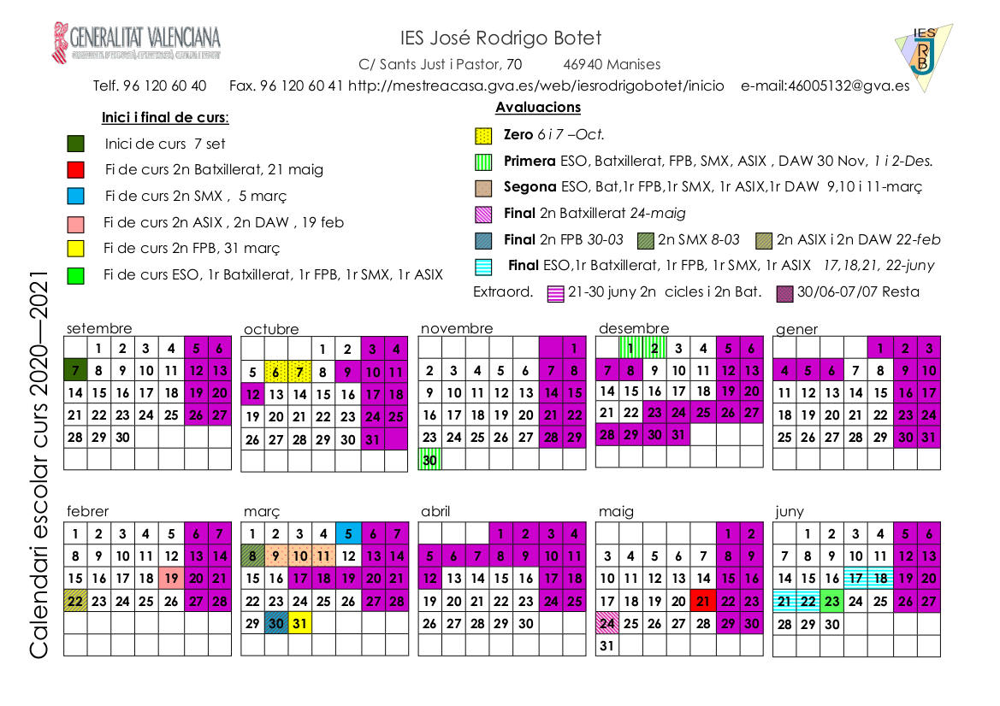

Calendario del curso
===============

Objetivos del módulo
===============
+ Administra servicios de **resolución de nombres**, analizándolos y garantizando la seguridad del servicio.
+ Administra servicios de **configuración automática**, identificándolos y verificando la correcta asignación de los parámetros.
+ Administra **servidores Web** aplicando criterios de configuración y asegurando el funcionamiento del servicio.
+ Administra servicios de **transferencia de archivos** asegurando y limitando el acceso a la información.
+ Administra servidores de **correo electrónico**, aplicando criterios de configuración y garantizando la seguridad del servicio.
+ Administra servicios de mensajería instantánea, noticias y listas de distribución, verificando y asegurando el acceso de los usuarios.
+ Administra servicios de audio identificando las necesidades de distribución y adaptando los formatos.
+ Administra servicios de vídeo identificando las necesidades de distribución y adaptando los formatos.
+ **Gestiona entornos de virtualización.**

Contenidos
===============

<table style=" margin-left: auto;margin-right: auto;padding:5px; border:1;">
    <thead>
        <tr>
            <th>1ª Evaluación</th>
            <th>2ª Evaluación</th>
        </tr>
    </thead>
    <tbody>
        <tr>
            <td >Introducción a los Srvs. de red</td>
            <td >Interconexión de redes. Seguridad.</td>
        </tr>
        <tr>
        <td >Asignación dinámmica. DHCP</td>
        <td>Acceso remoto a ficheros.</td>
        </tr>
        <tr>
            <td >Sist. Nombres de dominio. DNS</td>
            <td>Servicio de Correo Electrónico</td>
        </tr>
        <tr>
        <td >Servidores web</td>
        <td>Otros Servicios</td>
        </tr>
    </tbody>
</table>

Funcionamiento
===============

+ Asistencia **PRESENCIAL semanas alternas**. A distancia, en el resto de horas.
+ Mayor grado de responsabilidad y autonomía por vuestra parte. **¡1 semana sin vernos!**
+ Mayor grado de flexibilidad e innovación por la mía
+ Si algo no funciona. Se cambia. Se habla...
+ Ventaja: vamos a usar **herramientas que ya conocemos** y que no nos deben ser complicadas de usar
  + Aules. → Materiales, tareas, cuestionarios, *foros, Chats*
  + Webex → [https://profevirtual.webex.com/meet/gimenez_manalb](https://profevirtual.webex.com/meet/gimenez_manalb)
  + Correo electrónico →[mtgimenez.prof@gmail.com](mailto:mtgimenez.prof@gmail.com)
  + Telegram (grupo para noticias/anuncios) → [Enlace al canal](https://t.me/joinchat/BUXkgRijEmvnH5P_Y9YV1Q)
+ Las explicaciones teóricas se harán en clase con Webex lo más reducidas posible y a trabajar (en clase o en casa).
+ Fuera de horario habrá unas horas de tutoría online para resolver dudas.
+ Los puestos están señalados. NO desplazar equipo o mobiliario.
+ Siempre nos sentaremos en el mismo sitio
+ Evitar tocar la pantalla.
+ Para evitar las pérdidas de información usa tu propio disco duro externo/portátil (además irá mas rápido que el equipo del aula)
+ **PACIENCIA y RESILIENCIA**
+ **Atención a las entradas/salidas de clase/patios**

Evaluación
===============

+ Prácticas / Ejercicios=60%
+ Examen Final Evaluación=40%
Como máximo el/la alumno-a puede dejar **3 ejercicios/practicas sin entregar** y en el examen final de cada evaluación debe sacar un **mínimo de 3**.

APROBAR LA 1ª EVALUACIÓN SIGNIFICA SUPERAR ESA PARTE DEL MODULO PROFESIONAL.
