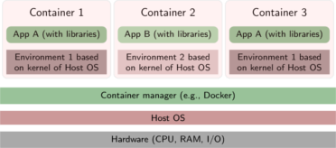

INTRODUCCIÓN
==============
La finalidad de una red, bien sea local o de área extensa, es que los usurarios de los sistemas informáticos de una organización puedan hacer un mejor uso de los mismos mejorando de este modo el rendimiento global de la organización, medianta la utilización de servicios como:
+ Acceso remoto a archivos.
+ Correo Electrónico
+ Acceso a información de hipertexto(pag. Web)
+ Otros servicios(muchos de ellos transparentes para l@s usuari@s)

Conceptos previos
------------------
**LA ARQUITECTURA CLIENTE/SERVIDOR**

Es la estructura en la que se basa el funcionamiento de los servicios de red. Es un modelo de aplicación distribuida en el que las tareas se reparten entre los proveedores de recursos o servicios, llamados servidores, y los demandantes, llamados clientes. Un cliente realiza peticiones a otro programa, el servidor, que le da respuesta. **Especialmente adecuada para REDES de computadores.**

Las características de ambos tipos de equipos suelen ser distintas:
<table style=" margin-left: auto;margin-right: auto;padding:5px; border:1;">
    <thead>
        <tr>
            <th>Clientes</th>
            <th>Servidores</th>
        </tr>
    </thead>
    <tbody>
        <tr>
            <td >
            <ul>
              <li>Menor potencia de cálculo</li>
              <li>Peticiones al srv.</li>
              <li>Menor potencia de cálculo</li>
              <li>Interactuar con varios srv.</li>
              <li>If visual+   Conectividad</li>
            </ul>
            </td>
            <td >
            <li>Mayor potencia de cálculo</li>
            <li>Permanece a la espera</li>
            <li>Gran número de peticiones</li>
            <li>Prioridad rendimiento</li>
            <li>Seguridad</li>
            </td>
        </tr>
    </tbody>
</table>

**INTERNET**

No es más que un conjunto de redes locales **interconectadas** entre sí:
+ **LAN vs WAN**
+ La conexión se realiza a través de dispositivos denominados *nodos*
+ Los servicios, en un principio, se ofrecen dentro de la red local.
+ Para hacerlos públicos en Internet han de realizarse las correspondientes configuraciones.

___
> **RECUERDA...**
1. ¿Que dispositivos  HW actuan típicamente como NODOS?
2. ¿Que Hardware necesitan obligatoriamente esos dispositivos?.
3. ¿Como se llama la accion de ”hacer visible” un servicio a traves de Internet?
4. ¿Podrías hacerlo en tu casa?
5. ¿Y la acción que permite a los equipos de una LAN navegar por Internet?
___

Componentes de los Srv. de Red
------------------
Para poder configurar correctamente cualquier servicio, se deben tener claros algunos conceptos relacionados con las redes informáticas.

**PROTOCOLOS**

En el campo de las telecomunicaciones, un protocolo de comunicaciones es el conjunto de reglas normalizadas para la representación, señalización, autenticación y detección de errores necesario para enviar información a través de un canal de comunicación.
Al conjunto de protocolos que aseguran la comunicaciones entre dos o más sistemas las denominamos *pila de protocolos*. Conocemos dos modelos, uno funciona como marco práctico (**OSI**) y el otro es el más utilizado en la práctica (**TCP/IP**). Los distintos protocolos trabajan directamente con sus iguales en el otro extremo de la comunicación.

En este módulo nos vamos a centrar en algunos de los protocolos más importantes de la **capa de Aplicación**

**DIRECCIONAMIENTO IP:**

Una dirección IP es una etiqueta numérica que identifica a un interfaz (elemento de comunicación/conexión) de un dispositivo (habitualmente una computadora) **dentro de una MISMA red** que utilice el protocolo IP (Internet Protocol), que corresponde al nivel de red del protocolo TCP/IP.

<u>CARACTERÍSTICAS:</u>
+ Existen 5 clases.
+ Nos interesan los tres primeros (A, B y C)
+ Hay dos tipos de  direcciones
  + Públicas
  + Privadas
+ IPv4 vs IPv6

<u>OTROS PARÁMETROS IP:</u>

Además de la dirección IP, todo equipo necesita tener definidos otros parámetros para poder interactuar en la red correctamente.
+ **MÁSCARA DE SUBRED**: La máscara permite distinguir los bits que identifican la red y los que identifican el host de una dirección IP.
+ **PUERTA DE ENLACE/GATEWAY/PASARELA**: Direccion del dispositivo que permite interconectar redes con protocolos y arquitecturas diferentes a todos los niveles de comunicación. *Obligatoriamente debe estar en la misma red que el equipo*.
+ **SERVIDOR/ES DNS**: Direccion/es de aquel/aquellos equipo/s encargado/s de traducir los nombres de dominio por su correspondiente IP. *Puede estar en una red externa*.

___
> **RECUERDA...**
1. ¿Que elemento maneja el nivel de enlace, el de red y el de transporte, para realizar sus funciones correspondientes?
2. Explica la estructura de las tres clases de direcciones IP que nos interesan, indicando la cantidad de redes existentes y el número de ordenadores que podemos incluir en cada una de esas redes. Indica, para cada clase, los rangos de direcciones públicas y privadas.
3. Explica las diferencias entre las dos versiones de IP comentadas.
4. Indica los comandos que utilizarías para averiguar la información IP, tanto en Windows como en Linux.
5. Averigua tu IP pública.¿Cual es la de tus compañeros?¿Podrías explicarlo?
6. ¿La puerta de enlace ha de pertenecer a tu red para funcionar correctamente?¿y los servidores DNS?
7. De los protocolos de la capa de aplicación, nombra 5 e indica su función y el nº de puerto que utilizan para operar.
___

Virtualización
------------------

El funcionamiento de los servidores hoy día no tiene nada que ver con lo que sucedía hace unos pocos años. Se ha pasado de un alojamiento en máquinas reales, las cuales incluso albergaban varios servicios, a trabajar con máquinas simuladas que ofrecen unicámente un servicio. Estas técnicas reciben el nombre de *Virtualización*. La virtualización de sistemas es una potente **técnica de abstracción mediante la cual podemos crear una capa intermedia que se encarga de posibilitar la comunicación entre una máquina física (anfitrión o host) y el sistema o sistemas huésped (guest) virtuales**.

**VENTAJAS**
+ Reducción de costes y mejor gestión de los recursos hardware. Cada máquina física puede usarse para varios propósitos a la vez, con los recursos adecuados.
+ Sustitución de ordenadores por un fondo de MV (pool) que puedan ser creadas, clonadas y destruidas a demanda.
+ Posibilidad de vender capacidad de cálculo a otras empresas
(Virtual Private Servers).
+ Simplificación de los sistemas de copia de seguridad.
Entornos para aprendizaje y pruebas. Se simplifica el montaje y experimentación de otros sistemas operativos y software distinto al que usamos habitualmente. Ideal para estudiantes.
+ Compatibilidad de programas. Posibilidad de usar programas que no ofrezcan versiones para nuestro sistema habitual.
+ Entornos controlados. Se pueden probar programas en los que no confiamos,
+ Fácil migración de unos ordenadores a otros.

### Tipos de Virtualización.

**TIPO 1:** Denominada **nativa/unhosted**, es software que se ejecuta directamente sobre el hardware, para ofrecer la funcionalidad.

**TIPO 2:** denominada **hosted o paravirtualización**, es software que se ejecuta **sobre un SO** para ofrecer la funcionalidad(con la consiguiente penlización en rendimiento).

**CONTENEDORES:** Es una alternativa más de virtualización, que persigue mejorar el rendimiento y permitiendo el diseño de infraestructuras de trabajo más dinámicas.
Posibilidad de aplicaciones de gestión automática(Kubernetes..)

**CLOUD virtualization:**   Virtualización en sistemas remotos, con todas la ventajas del cloud computing (Azure, AWS, GoogleCloud..)

### Gestión de la virtualización.
### Contenedores

Entorno de trabajo
------------------
