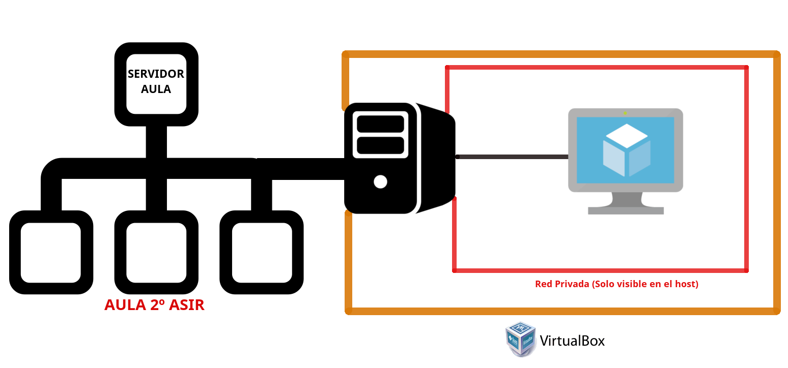
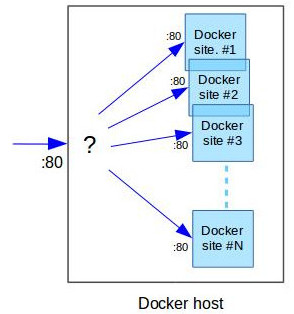

Entorno de trabajo
===================
Para el módulo de Servicios de Red e Internet el escenario más típico a configurar en nuestros servidores virtualizados (en los SSOO correspondientes), serán los siguientes:
* Una tarjeta de red conectada a la red real del aula. Esta será la **IP pública** de ’nuestra red’ virtualizada.
* El resto de tarjetas de red configuradas de manera que solo sean visibles en nuestro equipo, y en la **red privada** correspondiente.

Para probar el funcionamiento de nuestros servidores, crearemos MV que actúen como clientes, teniendo una única interfaz de red, la cual se conectará a la red privada .

En algunos apartados del módulo (especialmente en el servicio web) podremos encontrarnos con escenarios donde ejecutemos múltiples instancias de contenedores para simular un entorno de alta disponibilidad<b><a class="footnote-ref" href="#fn:note1" role="doc-noteref">1</a></b>.

       

       <ol>
           <li class="footnote" id="fn:note1">
               

                   <b>En la imagen el símbolo ? es un balacenador de carga:</b>
                   <a href="https://httpd.apache.org/docs/2.4/howto/reverse_proxy.html" target="_blank">apache</a> o <a href="https://nginx.org/en/docs/http/load_balancing.html" target="_blank">NginX</a>
                    <a class="footnote-backref" rev="footnote" href="#fnref:note1">&#8617;</a>
               

           </li>
       </ol>
   

