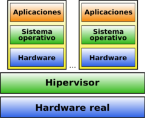

Virtualización
==============

El funcionamiento de los servidores hoy día no tiene nada que ver con lo que sucedía hace unos pocos años. Se ha pasado de un alojamiento en máquinas reales, las cuales incluso albergaban varios servicios, a trabajar con máquinas simuladas que ofrecen unicámente un servicio. Estas técnicas reciben el nombre de *Virtualización*. La virtualización de sistemas es una potente **técnica de abstracción mediante la cual podemos crear una capa intermedia que se encarga de posibilitar la comunicación entre una máquina física (anfitrión o host) y el sistema o sistemas huésped (guest) virtuales**.

**VENTAJAS**
+ Reducción de costes y mejor gestión de los recursos hardware. Cada máquina física puede usarse para varios propósitos a la vez, con los recursos adecuados.
+ Sustitución de ordenadores por un fondo de MV (pool) que puedan ser creadas, clonadas y destruidas a demanda.
+ Posibilidad de vender capacidad de cálculo a otras empresas
(Virtual Private Servers).
+ Simplificación de los sistemas de copia de seguridad.
Entornos para aprendizaje y pruebas. Se simplifica el montaje y experimentación de otros sistemas operativos y software distinto al que usamos habitualmente. Ideal para estudiantes.
+ Compatibilidad de programas. Posibilidad de usar programas que no ofrezcan versiones para nuestro sistema habitual.
+ Entornos controlados. Se pueden probar programas en los que no confiamos,
+ Fácil migración de unos ordenadores a otros.

**INCONVENIENTES**
+ Un único punto de fallo para todas las máquinas virtuales que se ejecuten en un único servidor físico. Para solucionarlo se deben utilizar **servidores con un alto nivel de redundancia** de discos, memoria, red, fuente de alimentación, y demás componentes (algo bastante más fácil de conseguir si trabajamos en entornos virtualizados)

  **Actualmente se asocia un único servicio a cada servidor, con el fin de limitar el alcance de un hipotético fallo**

### Tipos de Virtualización.

**TIPO 1:** Denominada **nativa/unhosted**, es software que se ejecuta directamente sobre el hardware, para ofrecer la funcionalidad. El hipervisor es un SO cuya única misión es gestionar conjuntos de clusters, Máq. Virtuales, unidades de almacenamiento, etc... Un ejemplo de este tipo de virtualización [lo puedes encontrar en el siguiente video](https://youtu.be/ERb_X20UKqU), en el que muestran una instalación real de un hipervisor denominado [Proxmox](https://www.proxmox.com/en/).

**Ejemplos**
* Proxmox
* PowerVM (IBM)
* ESXi (VmWare)
*  Xen
*  OpenVZ

**TIPO 2:** denominada **hosted o paravirtualización**, es software que se ejecuta **sobre un SO** para ofrecer la funcionalidad(con la consiguiente penlización en rendimiento). Es la virtualización que has usado hasta ahora.

**Ejemplos**
* Parallels (Windows/Mac/Linux)
* VMware (Windows / Linux)
* VirtualBox (Windows/Mac/Linux, Gratis)
* QEMU(Linux, Gratis)
* Windows Virtual PC (Windows, Gratis)

**CONTENEDORES:** Es una alternativa más de virtualización, que persigue mejorar el rendimiento y permitiendo el diseño de infraestructuras de trabajo más dinámicas.
Posibilidad de aplicaciones de gestión automática(Kubernetes..)

**Ejemplos**
* Docker
* LXC/LXD
* Windows servers containers

**CLOUD virtualization:**   Virtualización en sistemas remotos, con todas la ventajas del cloud computing (Azure, AWS, GoogleCloud..)

**Ejemplos**
* Azure
*  Amazon Web Services.
* Google Cloud
* ……

> **Puedes encontrar un interesante artículo de las diferencias entre MV y contenedor, y la evolución de estas tecnologías en los últimos años en el [siguiente blog](https://www.xataka.com/otros/docker-a-kubernetes-entendiendo-que-contenedores-que-mayores-revoluciones-industria-desarrollo)**.

### Gestión de la virtualización.

A la hora de virtualizar SO, debemos tener varios elementos y parametros de configuracion en cuenta. En concreto, **utilizando VirtualBox** debemos prestar especial atención a:

* **Requisitos del SO a virtualizar** → En el apartado de **Configuración** de VBox (Memoria, procesador..)
* **Medios virtuales** → Para incluir el/los discos duros necesarios para nuestro sistema, además de vinular la ISO del SO que queremos instalar.
* **Configuracion de red en las MV** → Uno de los apdos. más importantes. Debemos tener claro los distintos tipos de red en VBox y la utilidad de cada uno. Puedes encontrar una buena aclaración en el [apartado correspondiente del manual oficial de VirtualBox](https://www.virtualbox.org/manual/ch06.html#networkingmodes).
* **Dispositivos USB** → Extension Pack (se instala en la consola de administración de VBox)
* **Carpetas compartidas** → GuestAdditions (Se deben instalar en cada MV por separado. ¿Sabrías hacerlo en una MV sin interfaz gráfica(GUI)?). Puedes encontrar guías de como hacerlo en la web:
  * [Sistemas Linux](https://www.techrepublic.com/article/how-to-install-virtualbox-guest-additions-on-a-gui-less-ubuntu-server-host/).
  * [Sistemas Windows](http://somebooks.es/instalar-guest-additions-windows-server-2016-sin-escritorio-virtualizado-virtualbox/)

<b>PRÁCTICA 1</b>  
1.- Crea en tu equipo una MV del SO <b>Windows 2016 CON GUI</b>, instala las GuestAdditions y crea una carpeta compartida con tu SO anfitrion. Finalmente configura manualmente la tarjeta de red.   
2.- Crea en tu equipo una MV del SO <b>Windows 2016 sin GUI</b>, instala las GuestAdditions y crea una carpeta compartida con tu SO anfitrion. Finalmente intenta configurar manualmente la tarjeta de red mediante PowerShell.   
3.- Crea en tu equipo una MV del SO <b>Ubuntu Server 20.04</b>, instala las GuestAdditions y crea una carpeta compartida con tu SO anfitrion. Finalmente intenta configurar manualmente la tarjeta de red. 
Las dos MV únicamente deben verse entre ellas, fuera del alcance del resto de equipos del aula.
      

Envía un documento pdf con los pantallazos y características de los equipos, aportadndo las explicaciones que consideres oportunas.

### Contenedores
