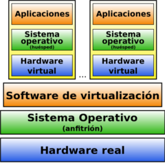

Virtualización
==============

El funcionamiento de los servidores hoy día no tiene nada que ver con lo que sucedía hace unos pocos años. Se ha pasado de un alojamiento en máquinas reales, las cuales incluso albergaban varios servicios, a trabajar con máquinas simuladas que ofrecen unicámente un servicio. Estas técnicas reciben el nombre de *Virtualización*. La virtualización de sistemas es una potente **técnica de abstracción mediante la cual podemos crear una capa intermedia que se encarga de posibilitar la comunicación entre una máquina física (anfitrión o host) y el sistema o sistemas huésped (guest) virtuales**.

**VENTAJAS**
+ Reducción de costes y mejor gestión de los recursos hardware. Cada máquina física puede usarse para varios propósitos a la vez, con los recursos adecuados.
+ Sustitución de ordenadores por un fondo de MV (pool) que puedan ser creadas, clonadas y destruidas a demanda.
+ Posibilidad de vender capacidad de cálculo a otras empresas
(Virtual Private Servers).
+ Simplificación de los sistemas de copia de seguridad.
Entornos para aprendizaje y pruebas. Se simplifica el montaje y experimentación de otros sistemas operativos y software distinto al que usamos habitualmente. Ideal para estudiantes.
+ Compatibilidad de programas. Posibilidad de usar programas que no ofrezcan versiones para nuestro sistema habitual.
+ Entornos controlados. Se pueden probar programas en los que no confiamos,
+ Fácil migración de unos ordenadores a otros.

**INCONVENIENTES**
+ Un único punto de fallo para todas las máquinas virtuales que se ejecuten en un único servidor físico. Para solucionarlo se deben utilizar **servidores con un alto nivel de redundancia** de discos, memoria, red, fuente de alimentación, y demás componentes (algo bastante más fácil de conseguir si trabajamos en entornos virtualizados)

  **Actualmente se asocia un único servicio a cada servidor, con el fin de limitar el alcance de un hipotético fallo**

### Tipos de Virtualización.

**TIPO 1:** Denominada **nativa/unhosted**, es software que se ejecuta directamente sobre el hardware, para ofrecer la funcionalidad. El hipervisor es un SO cuya única misión es gestionar conjuntos de clusters, Máq. Virtuales, unidades de almacenamiento, etc... Un ejemplo de este tipo de virtualización [lo puedes encontrar en el siguiente video](https://youtu.be/ERb_X20UKqU), en el que muestran una instalación real de un hipervisor denominado [Proxmox](https://www.proxmox.com/en/).

**Ejemplos**
* Proxmox
* PowerVM (IBM)
* ESXi (VmWare)
*  Xen
*  OpenVZ

**TIPO 2:** denominada **hosted o paravirtualización**, es software que se ejecuta **sobre un SO** para ofrecer la funcionalidad(con la consiguiente penlización en rendimiento). Es la virtualización que has usado hasta ahora.

**Ejemplos**
* Parallels (Windows/Mac/Linux)
* VMware (Windows / Linux)
* VirtualBox (Windows/Mac/Linux, Gratis)
* QEMU(Linux, Gratis)
* Windows Virtual PC (Windows, Gratis)

**CONTENEDORES:** Es una alternativa más de virtualización, que persigue mejorar el rendimiento y permitiendo el diseño de infraestructuras de trabajo más dinámicas.
Posibilidad de aplicaciones de gestión automática(Kubernetes..)

**Ejemplos**
* Docker
* LXC/LXD
* Windows servers containers

**CLOUD virtualization:**   Virtualización en sistemas remotos, con todas la ventajas del cloud computing (Azure, AWS, GoogleCloud..)

**Ejemplos**
* Azure
*  Amazon Web Services.
* Google Cloud
* ……

> ##### Puedes encontrar un interesante artículo de las diferencias entre MV y contenedor, y la evolución de estas tecnologías en los últimos años en el **[siguiente blog](https://www.xataka.com/otros/docker-a-kubernetes-entendiendo-que-contenedores-que-mayores-revoluciones-industria-desarrollo)**.

### Gestión de la virtualización.
### Contenedores
