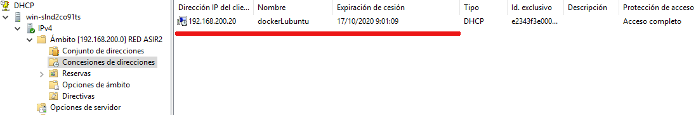

Comprobando el funcionamiento
==============================

En cualquier servicio resulta fundamental poder comprobar su funcionamiento, para detectar algún error en su ejecución, problema de seguridad o para la generación de informes. Las comprobaciones en el servicio DHCP implican también la comprobación de las **concesiones(leases)** concedidas.

.. raw:: html

    

    En cualquier servicio deberías saber hacer comprobaciones parecidas, sabiendo qué fichero/s debes consultar y los comandos a ejecutar para averiguar el estado del servicio.
    
 

Windows
--------
Una vez tenemos configurado nuestro servidor, podemos consultar su estado en la pantalla de administración, en el apartado de **lista de concesiones**  vemos las configuraciones de cliente actualmente activas.

En realidad esta información se almacena en el fichero **%SystemRoot%\System32\dhcp\DhcpSrvLog-XX** (Donde XX es el dia de la semana)

También tenemos la posibilidad de consultar esta información a través de algunos comandos de **PowerShell**.

    .. code-block:: shell-session

          PS C:\> Get-DhcpServerv4Lease -ScopeId 192.168.200.0 [-AllLeases]
          PS C:\> Get-DhcpServerDatabase | Get-DhcpServerSetting

.. image:: img/listadoConcesionesWindowsPS.png
        :width: 600 px
        :alt: Comando power shell para listar las concesiones DHCP
        :align: center

Linux
--------

En Linux, las opciones que tenemos para comprobar el estado de nuestro servidor DHCP pasan por la ejecución de algunos comandos del sistema. **Serán bastante parecidos para cualquier servicio que configuremos**. A continuación tienes algunos ejemplos, recuerda que el uso de **tuberías (|)** te ayudará a filtrar mejor tus resultados.

* Comprobación del log del sistema
            .. code-block:: shell-session

              $cat /var/log/syslog
              $sudo service isc-dhcp-server status
              $sudo systemctl status isc-dhcp-server
              $journalctl -xe
              $tail /var/log/syslog | grep dhcpd

      Un ejemplo de ejecución del último comando podría ser:

        .. image:: img/estadoDhcpUbuntu.png
            :width: 600 px
            :alt: Comando estado DHCP Linux
            :align: center

* Listado de concesiones realizadas (**fichero /var/lib/dhcpd/dhcpd.leases**):
            .. code-block:: shell-session

              $cat /var/lib/dhcpd/dhcpd.leases

      Que muestra estructuras similares a la siguiente:

        .. image:: img/concesionUbuntu.png
            :width: 600 px
            :alt: Ejemplo concesion ubuntu
            :align: center
