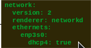

Configuración del servicio
=============================

Vamos aprender a configurar tanto los clientes (las interfaces de red que solicitan una configuración dinámica) como los servidores. En ambos casos trabajaremos con sistemas operativos Windows y Linux, con GUI y sin ella.

Configuración clientes
----------------------

Windows
^^^^^^^

**GUI**

En las propiedades de la interfaz (tarjeta) de red correspondiente:

    .. image:: img/confClienteWindowsGui.png
        :width: 400 px
        :alt: NAS Diagram
        :align: center

**Línea de comandos**

En PowerShell, a través del comando `Set-NetIPInterface <https://docs.microsoft.com/en-us/powershell/module/nettcpip/set-netipinterface?view=win10-ps>`_ (debemos asegurarnos de borrar las posibles direcciones estáticas que se hayan asignado a la interfaz usando el comando
`Remove-NetIPAddress <https://docs.microsoft.com/en-us/powershell/module/nettcpip/remove-netipaddress?view=windowsserver2019-ps>`_ )

.. code-block:: shell-session

              PS C:\>Set-NetIPInterface -InterfaceIndex 5 -Dhcp Enabled

Si quisiéramos dejar de nuevo una configuración estática deberíamos hacer algo como lo siguiente (observa el uso de los comandos **New-NetIPAddress** y **Set-NetIPAddress**).

.. code-block:: shell-session

              PS C:\> New-NetIPAddress -InterfaceIndex 5 -IPAddress 192.168.200.254
              PS C:\> Set-NetIPAddress -InterfaceIndex 5 -IPAddress 192.168.200.254 -PrefixLength 24

Linux
^^^^^^^
`Netplan <https://netplan.io/>`_ es el sistema de gestión de la red, sustituyendo al antiguo gestor. Puede trabajar de dos maneras (renderers):
  * **NetworkManager (GUI)**
  * **Systemd-networkd (CLI)**

**GUI**

Debemos asociar las tarjetas al gestor gráfico (**en netplan, renderer: NetworkManager**). Desde ese momento ya tenemos la gestión gráfica. Para desactivarla hay que parar el servicio network-manager.

La imagen siguiente es orientativa, la interfaz cambiará en función de la distro de Linux y de la versión de la misma.

    .. image:: img/confLinuxGUI.png
        :width: 400 px
        :alt: NAS Diagram
        :align: center

.. raw:: html

    

    Se debe optar por una de los dos modos de configuración(interfaz gráfica / ficheros de configuración)
    
 

**Línea de comandos**

Para la configuración (a través del fichero yaml ubicado en **/etc/netplan**) de las tarjetas, puedes `encontrar en la web <https://netplan.io/examples/>`_ muchos ejemplos de ello.
Para la consulta, el up/down y  la actualización de las tarjetas tenemos comandos como:

        * Recargar la configuración (después de una modificación en el fichero netplan)
            .. code-block:: shell-session

              $sudo netplan apply
        * Volver a solicitar la concesión de configuración al srv. DHCP
            .. code-block:: shell-session

              $sudo dhclient
        * Comprobar las direcciones de las interfaces
            .. code-block:: shell-session

              $ip a
              $ifconfig
        * Comprobar la dirección de una interfaz en concreto.
            .. code-block:: shell-session

              $ip a show eth0
              $ip a list eth0
              $ip a show dev eth0
        * Mostrar únicamente interfaces en funcionamiento
            .. code-block:: shell-session

              $ip link ls up
        * Cambiar el estado de una interfaz (a veces nos ayudará a actualizar la configuración tras modificaciones en el fichero netplan)
            .. code-block:: shell-session

              #ip link set dev {DEVICE} {up|down}

Configuración servidor
----------------------

Windows
^^^^^^^

.. raw:: html

    

      <b>GUI </b><a class="footnote-ref" href="#fn:note1" role="doc-noteref">1</a>
    

De manera visual a traves de la interfaz gráfica que ofrece Windows 2012/2016/2019 Server y la instalación de roles y características.
    .. image:: img/confSrvWindowsGui.png
        :width: 400 px
        :alt: NAS Diagram
        :align: center

Puedes encontrar un ejemplo de configuración paso a paso en el siguiente video:

.. raw:: html

    <iframe width="250" style="display:block; margin-left:auto; margin-right:auto;"src="https://www.youtube.com/embed/5AMMCAcw3js" frameborder="0" allow="accelerometer; autoplay; clipboard-write; encrypted-media; gyroscope; picture-in-picture" allowfullscreen></iframe> 

    

    <u>¿Sabrías?</u> 
    Montar el siguiente escenario en Virtualbox, virtualizando como servidor el SO Windows Server y como cliente el que tú prefieras:
    <ol>
        <li>Un servidor conectado a la red local del aula con la primera interfaz.</li>
        <li>La segunda solo visible en su propio equipo con una IP tipo C FIJA. Configuración mínima, ya que no sale a ninguna red externa con esta interfaz.</li>
        <li>Un servidor DHCP repartiendo dirección en su red local, sin subnetting, y pasando a los clientes como gateway y como DNS la dirección del propio servidor.</li>
        <li>Añadir dos tarjetas más internas al servidor (de manera que tenga una tarjeta en modo puente y tres en red interna). Dale una configuración estática a cada tarjeta interna y finalmente crea un ámbito DHCP en cada una de ellas. Cada tarjeta
        interna estará en una red interna distintas DHCP1, DHCP2 y DHCP3.</li>
        <li>Probar el funcionamiento del servidor conectando un cliente virtualizado con red interna, probando cada uno de los 3 ámbitos.</li>
        <li>Generar el fichero con la exportación de la configuración de tu servidor DHCP (puedes generarlo con el comando <a href="https://learn.microsoft.com/en-us/powershell/module/dhcpserver/export-dhcpserver?view=windowsserver2022-ps" target="_blank">
        Export-DhcpServer</a> )</li>
    </ol>
    
 

.. raw:: html

    

      <b>Línea de comandos </b><a class="footnote-ref" href="#fn:note2" role="doc-noteref">2</a>
    

* Instalación
            .. code-block:: shell-session

              Install-WindowsFeature DHCP -IncludeManagementTools
* Configuración de un ámbito y sus opciones. Un ejemplo podría ser:
            .. code-block:: shell-session

              Add-DhcpServerv4Scope -name "RedAula2" -StartRange 192.168.200.11 -EndRange 192.168.200.254 -SubnetMask 255.255.255.0 -State Active
              Set-DhcpServerv4OptionValue  -ComputerName win-ts9g7n11dbe -ScopeId 192.168.200.0 -DnsServer 192.168.200.254 -Router 192.168.200.254 -Force

* Exportar/Importar configuración DHCP server a fichero de texto.
            .. code-block:: shell-session

              PS C:\> Export-DhcpServer -ComputerName "dhcpserver.contoso.com" -File "C:\exportdir\dhcpexport.xml" [-ScopeId 10.10.10.0,10.20.20.0]
              PS C:\> Import-DhcpServer -ComputerName "dhcpserver.contoso.com" -File "C:\exports\dhcpexport.xml" -BackupPath "C:\dhcpbackup\" [-ScopeId 10.10.10.0,10.20.20.0]

.. raw:: html

        

        <b>PRÁCTICA 1</b>  
        Accede al aula virtual del módulo y completa la primera práctica del Tema2, en la que crearás el ámbito DHCP con PowerShell. Envía <b>la secuencia de comandos de PowerShell</b> que has utilizado para solucionar la práctica.
        

         

Linux
^^^^^^^

.. raw:: html

    

      Se suele configurar directamente con el fichero de configuración correspondiente<a class="footnote-ref" href="#fn:note3" role="doc-noteref">3</a>, pero existen programas denominados <b>paneles</b> que nos permiten configurar los servidores a través de un <b>entorno web</b> (uno de los muchos ejemplos que existen puede ser <a href="https://www.webmin.com/">Webmin</a>).
    

En Ubuntu srv 18.04/20.04 el servidor que viene en sus repositorios es **isc-dchp-server**, en el que destacan 2 Ficheros de configuración a tener en cuenta:

  1. **/etc/default/isc-dhcp-server** → Interfaces donde trabaja el srv dhcp
  2. **/etc/dhcp/dhcpd.conf** → Configuración y def. De ámbitos

Un ejemplo sencillo de configuración de un ámbito (**subnet en el fichero dhcpd.conf**) podría ser:

    .. image:: img/ejemploConfUbuntu.png
        :width: 400 px
        :alt: NAS Diagram
        :align: center

Además de gestiónar el servicio con los siguiente comandos (podemos elegir entre las dos opciones):

            .. code-block:: shell-session

              $sudo service isc-dhcp-server [restart|start|stop|status]
              $sudo systemctl [restart|start|stop|status] isc-dhcp-server.service

Puedes encontrar un ejemplo de configuración paso a paso en el siguiente video:

.. raw:: html

        <iframe width="250" style="display:block; margin-left:auto; margin-right:auto;"src="https://www.youtube.com/embed/eWwasdFtIzM" frameborder="0" allow="accelerometer; autoplay; clipboard-write; encrypted-media; gyroscope; picture-in-picture" allowfullscreen></iframe> 
        

        <b>PRÁCTICA 2</b> 
        Accede al aula virtual del módulo y completa la segunda práctica del Tema2, configurando un srv DHCP en Ubuntu. Envía <b>el fichero /etc/dhcpd/dhpd.conf y el de configuración de red</b> como solución a la práctica.
        

         

.. raw:: html

    

    <u>¿Sabrías?</u> 
    En todos los servidores DHCP tenemos la opción de incluir <b>RESERVAS</b>, las cuales son muy útiles para configurar equipos especiales de nuestra red, tales como:
    <ul>
      <li>Impresoras</li>
      <li>Servidores</li>
      <li>...........</li>
    </ul>
    ¿Podrías configurar alguna reserva en tus servidores DHCP?
    
 

.. raw:: html

    
   

       

       <ol>
           <li class="footnote" id="fn:note1">
               

                   <b>Inst. y configuración servidor DHCP Windows(GUI):</b> <a href="https://social.technet.microsoft.com/wiki/contents/articles/51170.microsoft-windows-server-2016-dhcp-server-installation-configuration.aspx" target="_blank">Doc. oficial de Microsoft</a> <a class="footnote-backref" rev="footnote" href="#fnref:note1">&#8617;</a>
               

           </li>
           <li class="footnote" id="fn:note2">
               

                   <b>Inst. y configuración servidor DHCP Windows(PowerShell):</b> <a href="https://docs.microsoft.com/en-us/windows-server/networking/technologies/dhcp/dhcp-deploy-wps" target="_blank">Doc. oficial de Microsoft</a> / <b>comandos DHCP PowerShell:</b> <a href="https://docs.microsoft.com/en-us/powershell/module/dhcpserver/?view=win10-ps" target="_blank">Doc. oficial de Microsoft</a> <a class="footnote-backref" rev="footnote" href="#fnref:note2">&#8617;</a>
               

           </li>
           <li class="footnote" id="fn:note3">
               

                   <b>Manual completo de ISC-DHCP-SERVER:</b> <a href="https://www.fpgenred.es/DHCP/etcdhcpdhcpdconf.html" target="_blank">FPGENRED</a> <a class="footnote-backref" rev="footnote" href="#fnref:note2">&#8617;</a>
               

           </li>
       </ol>
   

