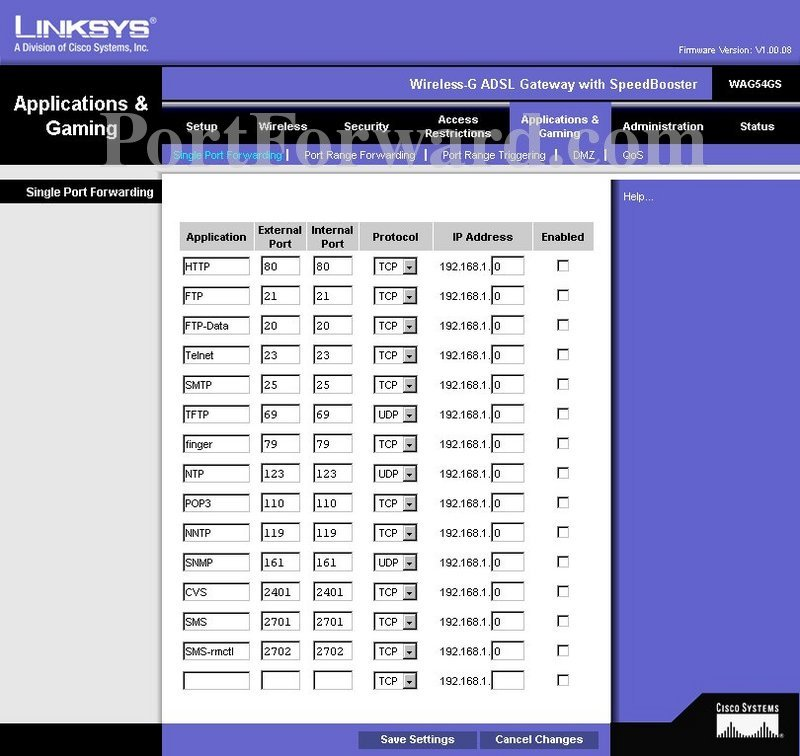

Apertura de puertos
=====================

También llamado **Forwarding o Reenvío** de puertos. Se puede configurar de diversas maneras:

Si trabajamos sobre un ROUTER, y queremos hacer accesible algún servicio en nuestra red desde el exterior, debemos configurar el dispositivo de manera que las peticiones que lleguen por la interfaz externa al puerto correspondiente, las redirigimos a la IP donde se encuentre alojado ese servidor.

Si trabajamos, como en nuestro caso, configurando un SISTEMA OPERATIVO como Router, tenemos diferentes opciones, en función del SO:

* WINDOWS: Con comando **netsh** (`ejemplo en la web <-https://superuser.com/questions/1131001/howto-do-a-port-forwarding-on-a-windows-2012-server>`_)
* LINUX: También, con IpTables.

      .. code-block:: shell-session

                # iptables -A PREROUTING -t nat -i eth0 -p tcp --dport 80 -j DNAT --to 192.168.1.2:8080
                # iptables -A FORWARD -p tcp -d 192.168.1.2 --dport 8080 -j ACCEPT

      .. warning::
            En el código anterior :

            * **Eth0**: nombre int. Externa del servidor.
            * **80** puerto donde se reciben las conexiones externas
            * **192.168.1.2**: IP interna del equipo destino.
            * **8080**: Puerto en el equipo destino.
