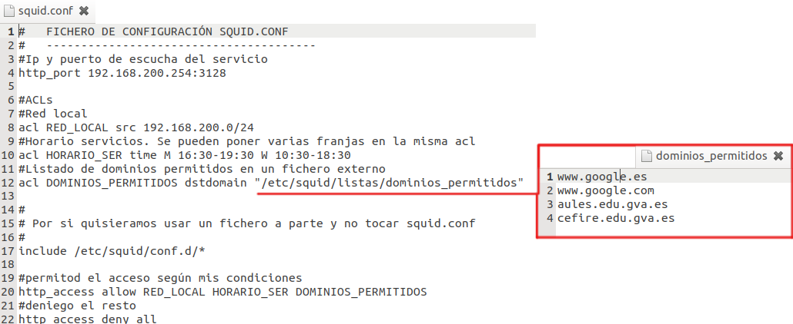
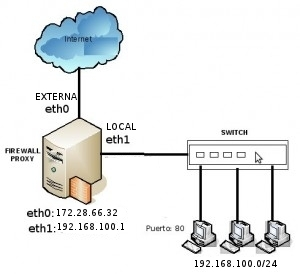

Seguridad. Proxy-Caché
==============================

Un proxy es un programa o dispositivo que realiza una acción en representación de otro. Esta situación estratégica de punto intermedio suele ser aprovechada para soportar una serie de funcionalidades:

      * PROPORCIONAR CACHÉ.
      * CONTROL DE ACCESO
          * Si lo que se gestiona es el acceso desde el exterior a los recursos internos de nuestra red estaríamos hablando de un `proxy inverso <https://es.wikipedia.org/wiki/Proxy_inverso>`_.
      * REGISTRO DEL TRÁFICO
      * PROHIBIR CIERTO TIPO DE TRÁFICO.
      * REGULACION ANCHO DE BANDA

El uso mas común de este servicio se encuentra en Internet. Se trata de un **proxy para el control del acceso a la web (principalmente los protocolos HTTP y HTTPS)**, proporcionando una caché para las páginas web y los contenidos descargados. Cuando esto sucede se dice que el proxy web está haciendo un servicio de proxy-cache. Esta caché es compartida por todos los usuario del proxy, con la consiguiente mejora en los tiempos de acceso para consultas coincidentes. Al mismo tiempo libera la carga de los enlaces hacia Internet.

Squid
--------

Vamos a estudiar uno de los proxy más ampliamente utilizado en la actualidad, **SQUID**, encontramos la version para Windows y para Linux. Siendo más utilizado en servidores Linux-Unix, ya que originariamente es un SW de esta platarfoma. La configuración es exactamente igual en los dos Sistemas Operativos.

Ya teniendo instalado nuestro servidor squid, ahora deberemos saber en donde se encuentra toda la configuración del mismo(**/etc/squid**). Ya dentro de esta carpeta se encontraran varios archivos pero el mas importante es el **squid.conf** el cual se encarga de la configuración del servicio. En la configuración de squid hay que distinguir varios elementos:

      1. Configuración General: Parámetros generales de funcionamiento del servicio.
            * IP/Puerto donde está trabajando el servicio.
            * Tamaño de la caché.
            * etc..
      2. **ACL (Lista de control de acceso)**: Definición de conjunto de elementos a los que se aplicarán reglas.
      3. **REGLAS**: Decisiones de autorización/denegación de acceso a ACL.

Los recursos que podéis encontrar en la web son muchos, por ejemplo el siguiente videotutorial:

.. raw:: html

            <iframe width="250" style="display:block; margin-left:auto; margin-right:auto;"src="https://www.youtube.com/embed/zXusMCM6p_k" frameborder="0" allow="accelerometer; autoplay; clipboard-write; encrypted-media; gyroscope; picture-in-picture" allowfullscreen></iframe> 

O también podéis encontrar muchísimos recursos en la web:
    * `Wiki completa de configuración de Squid <https://wiki.squid-cache.org/SquidFaq/SquidAcl>`_.
    * `Unos cuantos ejemplos sencillos para comenzar <https://elpuig.xeill.net/Members/vcarceler/smx-m07/actividades/squid-a3>`_.
    * `Documentación oficial Squid <http://www.squid-cache.org/Doc/config/>`_.

.. important::
    * Puedes consultar los ficheros de registro del proxy en */var/log/squid*.
    * Los clientes del proxy pueden configurarse de diferentes maneras.

Para configurar los clientes que van a utilizar nuestro servicio de proxy tenemos varias opciones:

1. **Configuración de los navegadores**: Firefox, tiene en sus configuraciones la configurar el servidor intermediario.

            .. image:: img/conProxyNavegador.png
                  :width: 200 px
                  :alt: Configuración proxy en Firefox
                  :align: center

2. **Proxy de sistema**: Chrome u otros navegadores utilizan el proxy que se configura para todo el sistema.

            .. image:: img/conProxySistema.png
                  :width: 200 px
                  :alt: Configuración proxy en Windows 10
                  :align: center

3. Con un **fichero de configuración automática del proxy(PAC)**: Nos va a permitir automatizar algunos aspectos. Puedes ver más información en el `siguiente enlace <https://www.watchguard.com/help/docs/help-center/es-419/Content/es-419/Fireware/proxies/explicit_proxy/explicit_proxy_pacfiles_c.html?TocPath=Controlar%20el%20Tr%C3%A1fico%20de%20Red%7CServidores%20Proxy%7CAcerca%20del%20Proxy%20Expl%C3%ADcito%7C_____4>`_.

.. raw:: html

    

    <u>¿Sabrías?</u> 
    ¿Instalar el paquete Squid en una MV y realizar las configuraciones y pruebas pertinentes para comprobar su funcionamiento?¿Qué es lo que ocurre por defecto si no modificamos nada de la configuración inicial de Squid?
    
 

La configuración de nuestro servicio proxy, consistirá en la combinación de los tres elementos vistos anteriormente. Es importante comprender varios aspectos:

1. Las **reglas se aplican en orden**. Una vez se puede aplicar una regla a un paquete, no se le aplican las siguientes (ojo con dejar un **http_access allow all como regla final**).
2. El uso de la **negación (!)** puede ayudarnos bastante en la creación de reglas, pero puede tener resultados no esperados si no la utilizamos correctamente.
3. El aplicar **varias ACL a una misma regla** no es lo mismo que aplicar la misma regla a cada ACL por separado.

.. raw:: html

    

    Puedes encontrar un <b>ejemplo reducido de un fichero de configuración de Squid (squid.conf) </b>, para poder trabajar con él<a class="footnote-ref" href="#fn:note1" role="doc-noteref">1</a>, en el siguiente enlace:
    

.. image:: img/squid.conf
    :width: 400 px
    :alt: Ejemplo fichero configuración
    :align: center

Sería interesante que revisaras su contenido e intentaras comprender el funcionamiento que implica.

Como ejemplo más básico puedes probar a configurar lo siguiente.

1. Autorizar el acceso a los equipos de mi red local.
2. Únicamente en horario de Servicios de Red.
3. El acceso solo se autoriza a determinadas páginas web, contenidas en un fichero de texto.

El resultado debería ser algo parecido a lo siguiente:

Proxy transparente
------------------

La principal desventaja del uso de proxy es la necesidad de configurar los navegadores ”a mano”,  con la consiguiente desventaja en cuanto a seguridad y escalabilidad. La solución a esta situación pasa por la utilización de un **proxy transparente**. Para ello debe existir una configuración física como la que muestra la imagen.

.. warning::
   La configuración de un proxy transparente presenta algunos problemas cuando hablamos de acceso HTTPS. En la web puedes encontrar bastante información al respecto.

.. code-block:: shell-session

            echo 1 > /proc/sys/net/ipv4/ip_forward //No necesita reinicio
            #iptables -A FORWARD -j ACCEPT
            #iptables -t nat -A POSTROUTING -s 192.168.100.0/24 -o eth0 -j MASQUERADE
            #iptables -t nat -A PREROUTING -s 192.168.100.0/24 -p tcp --dport 80 -j REDIRECT --to-port 3128
            #iptables -t nat -A PREROUTING -s 192.168.100.0/24 -p tcp --dport 443 -j REDIRECT --to-port 3128

.. importante::

   * **192.168.100.0/24** es la red local de mi servidor.
   * **eth0** es la tarjeta externa del servidor
   * **3128** es el puerto por defecto de Squid

.. raw:: html

         
        

        <u><b>PRÁCTICA 2</b></u> 
        Realiza la práctica 2 del Tema 4 del aula virtual, configurando el acceso de tu red local a la web.
        

         

.. raw:: html

    
   

       

       <ol>
           <li class="footnote" id="fn:note1">
               

                   <b>Recuerda:</b> Haz antes de nada una copia de seguridad de tu squid.conf para evitar problemas.
               

       </ol>
   

