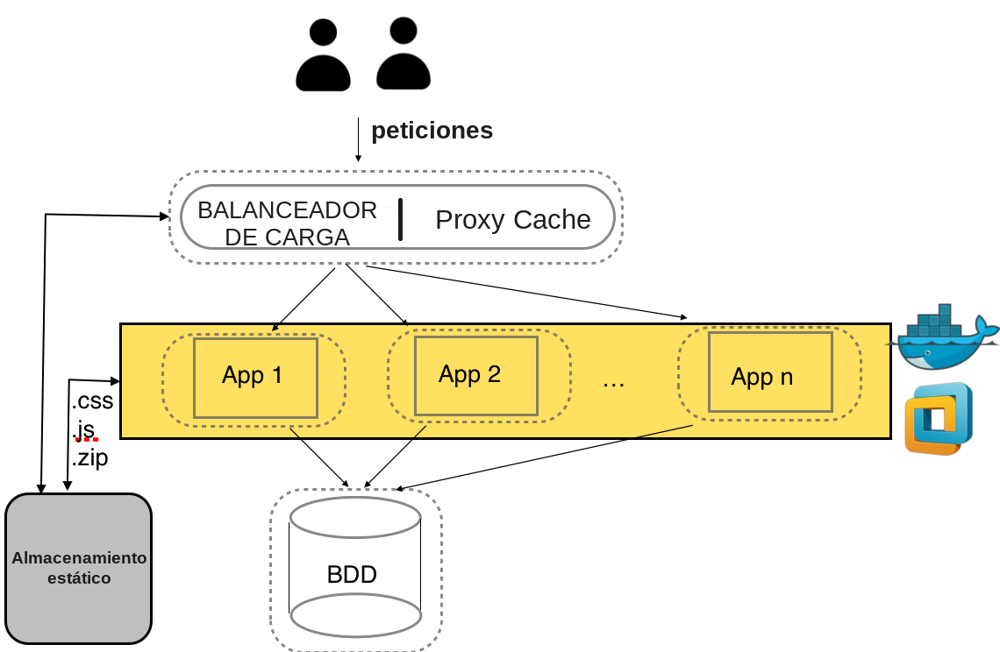

Alta disponibilidad
====================

Un siguiente nivel para mejorar el rendimiento sería la **ALTA DISPONIBILIDAD** mediante **REDUNDANCIA** de servidores. En estos casos tenemos un
servidor intermedio(proxy inverso) que puede actuar, por ejemplo, como:

    1. Balanceador de carga.
    2. Proxy cache

Tenemos diferentes alternativas si queremos configurar un escenario de redundancia (La mayoría de las webs que visitamos en realidad trabajan con estos esquemas)

    * **Apache** pueden configurarse para actuar como servidor intermedio (`documentación oficial <https://httpd.apache.org/docs/2.4/howto/reverse_proxy.html>`_ o una versión
      más simplificada en https://josejuansanchez.org/iaw/practica-05/index.html). 
    * En el caso de **NginX**, es uno de los puntos fuertes del programa (`guía en la documentación de CLOUDING.IO <https://help.clouding.io/hc/es/articles/360019908839-C%C3%B3mo-configurar-un-servidor-de-balanceo-de-carga-Nginx-en-Ubuntu-20-04>`_).
    * Existe SW específico que nos pueden ofrecer más alternativas de configuración (una de las más populares es `HAPROXY <http://www.haproxy.org/>`_).

.. important::

   ¿Te atreverías a montar tu primer balanceador de carga? Una buena manera para comenzar podría incluir la combinación de:

      * Una MV en la que se ejecute Apache y permita la ejecución de contenedores.
      * Conjunto de contenedores en la MV anterior ejecutando alguna imagen de Apache. Puedes buscarla en el `Docker Hub <https://hub.docker.com>`_.
      * Configuración del balanceo en NginX (una de sus especialidades), con el tutorial anterior.
      * Configuración del balanceador en Apache, tal y como muestra el siguiente video.

.. raw:: html

            <iframe width="300" style="display:block; margin-left:auto; margin-right:auto;" src="https://www.youtube.com/embed/G0cqFq_EedI" frameborder="0" allow="accelerometer; autoplay; clipboard-write; encrypted-media; gyroscope; picture-in-picture" allowfullscreen></iframe> 

.. raw:: html

        <!--  
        

        <u><b>PRÁCTICA 2</b></u> 
        Realiza la práctica 2 del Tema 5 del aula virtual. Monta un balanceador de carga en Apache.
        

          -->

En un entorno real se deben tener en cuenta muchos factores a la hora de configurar correctamente la alta disponibilidad, y
lograr que nuestro sitio web funcione correctamente y de manera transparente para l@s usuari@s, por ejemplo:

    * Lograr la **persistencia** de nuestra estructura de contenedores mediante el uso de `estructuras de almacenamiento de Docker <https://docs.docker.com/storage/>`_.
    * ¿Los servidores web alojados en los contenedores deben *'apuntar'* al mismo código web? (`Sticky sessions <https://www.imperva.com/learn/availability/sticky-session-persistence-and-cookies>`_)
    * ¿Usan la misma BD?
    * Automatizar la puesta en marcha y la parada de nuestro escenario lo máximo posible (`Docker-compose <https://docs.docker.com/compose/>`_ + `Kubernetes <https://kubernetes.io/es/docs/concepts/overview/what-is-kubernetes/#>`_)
