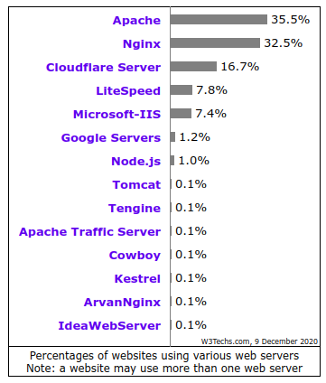

Configuración HTTP
==============================

**Los servidores web** son los encargados de servir a los navegadores los contenidos solicitados. Actualmente 3 son los principales servidores web que tienen un uso más extendido:

    1. **Apache**: Servidor Open Source disponible en sistemas Unix, Microsoft y Apple
    2. **NGINX**: Software libre y de código abierto, para Linux, FreeBSD y Windows, pensado para mejorar el rendimiento de apache.
    3. **Internet Information Services(IIS)**: Propiedad de Microsoft, únicamente para sistemas Windows.

Puedes encontrar una comparativa muy interesante entre la utilización de los distintos servidores
y otras tecnologías relacionadas en la `web de W3Techs <https://w3techs.com/technologies/comparison/ws-apache,ws-microsoftiis,ws-nginx>`_.

En cualquiera de los servidores que utilicemos debemos prestar especial atención a los siguientes elementos o propiedades:

    * Instalación y configuración del servicio sobre el **SO** e Infraestructura(**MV, contenedor**, cloud...) correspondiente.
    * Directorio/s donde se ubicarán el/los sitio/s web que administremos.
        * Permisos adecuados (chown/chmod) → *$¡¡¡¡¡¡¡¡sudo chmod -R 777!!!!*)
        * Espacio disponible
        * Seguridad (Backups, redundancia, ...)
    * Instalación módulos necesarios:
        * Lenguajes del lado servidor( PHP, ASP..)
        * Conectores con SGBD(Oracle,Dbase,MySql..)
        * Autenticación
        * Control de acceso
        * etc...
    * Configuración para conexiones seguras(encriptadas) mediante HTTPS.
    * Varios sitios en un mismo servidor (**VIRTUAL HOST**).
        * IP
        * **Nombre** → *Configuración DNS*
        * Puerto
    * Acceso remoto a la gestión de los archivos en el servidor
        * FTP
        * WebDAV.
    * Registro de sucesos en el servidor (LOG)

.. raw:: html

      
  <b>En el siguiente documento puedes encontrar un manual completo de como realizar la configuración básica de algunos servidores web.</b> 

.. image:: img/ConfiguracionservidoresHTTP.pdf
      :width: 400 px
      :alt: Tutorial configuración servidores Web
      :align: center

Apache
-------

Seguramente se trata del servidor web más conocido. Una de sus ventajas es la calidad de su `documentación oficial <https://httpd.apache.org/docs/2.4/>`_,
en la cual podemos encontrar información muy completa y tutoriales de creación de determinados escenarios.

  * Disponible para Linux, Windows, MAC.
  * ¿Instalación de un panel de administración para facilitar administración? → `p.e Webmin <https://doxfer.webmin.com/Webmin/Apache_Webserver>`_
  * Comprobamos los módulos instalados/activos.
  * Configurar opciones de Apache
      * Opciones por directorio.
      * Directivas
      * .htaccess
      * Permisos de acceso.
      * Espacios de usuario
      * Indizado de directorios para ver su contenido como una carpeta.
      * Hosting virtuales.

.. Important::
   ¿Sabrías realizar la configuración básica de un servidor Apache?

   1. Instala el servicio en una MV Ubuntu Server. Comprueba su acceso con los distintos modos de funcionamiento de la red en VirtualBox.
   2. Lista los módulos instalados en apache. Instala alguno más.
   3. Configura tu servidor para que, por ejemplo, sirva los sitios prueba1.com y prueba2.com.
   4. Permite el indizado de directorio en algún caso concreto.
   5. Activa el acceso con identificación.

.. raw:: html

         
        

        <u><b>PRÁCTICA 1</b></u> 
        Realiza la actividad indicada en el aula virtual y entrega el diploma obtenido a la finalización de la misma.
        

         

.. raw:: html

         
        

        <u><b>PRÁCTICA 2</b></u> 
        Realiza la actividad indicada en el aula virtual.
        

         

NginX
-------

.. raw:: html

    

    <b>NGINX, pronunciado en inglés como «engine-ex»</b>, es un famoso software de servidor web de código abierto <a class="footnote-ref" href="#fn:note1" role="doc-noteref">1</a>.
    En su versión inicial, funcionaba en servidores web HTTP.
    Sin embargo, hoy en día también sirve como proxy inverso, balanceador de carga HTTP y proxy de correo electrónico para IMAP, POP3 y SMTP.
    

La aparición de este servidor fue provocada por la búsqueda de un servicio web que
mejorara las prestaciones de Apache en páginas con una alta tasa de accesibilidad (en el orden de miles de conexiones simultáneas).
En realidad la configuración de un servidor y otro guardan ciertas semejanzas.

.. raw:: html

    

    Un ejemplo de fichero de configuración lo puedes ver en el siguiente enlace.
    

.. image:: img/nginxEjemplo.txt
    :width: 400 px
    :alt: Ejemplo fichero configuración NGINX
    :align: center

.. raw:: html

    

    Al igual que en el caso de Apache, puedes encontrar muchísima ayuda en la web<a class="footnote-ref" href="#fn:note2" role="doc-noteref">2</a>. Puedes encontrar, por ejemplo:
    <ul  style="padding-left: 5em;">
      <li>Listado de tutoriales en <b><a href="https://techexpert.tips/es/category/nginx-es/" target="_blank">https://techexpert.tips/es/category/nginx-es/</a></b>.</li>
      <li>acceder a este conjunto de videotutoriales en el que explican paso a paso como configurar un servidor NGINX.</li>
    </ul>
    

.. raw:: html

      <iframe width="300" style="display:block; margin-left:auto; margin-right:auto;" src="https://www.youtube.com/embed/eyxpLa9hUS8" frameborder="0" allow="accelerometer; autoplay; clipboard-write; encrypted-media; gyroscope; picture-in-picture" allowfullscreen></iframe>

.. raw:: html

    
   

   <u><b>PRÁCTICA 3</b></u> 
   Accede a la práctica 3 del Tema 5 del aula virtual. Realiza la configuración de un servidor NGINX.
   

    
    
    
   

       

       <ol>
           <li class="footnote" id="fn:note1">
               

                   <b>Fuente:</b> <a href="https://www.hostinger.es/tutoriales/que-es-nginx/" target="_blank">¿Qué es NGINX y cómo funciona?</a>
                   <a class="footnote-backref" rev="footnote" href="#fnref:note1">&#8617;</a>
               

           </li>
           <li class="footnote" id="fn:note2">
               

                   <b> Documentación oficial:</b> <a href="https://nginx.org/en/docs/" target="_blank">https://nginx.org/en/docs/</a>
                  <a class="footnote-backref" rev="footnote" href="#fnref:note2">&#8617;</a>
               

           </li>
       </ol>
   

