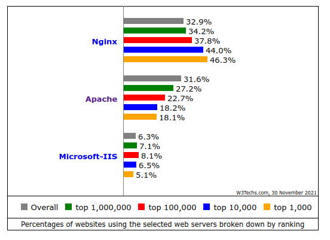

Configuración HTTP
==============================

**Los servidores web** son los encargados de servir a los navegadores los contenidos solicitados. Actualmente 3 son los principales servidores web que tienen un uso más extendido:

    1. **Apache**: Servidor Open Source disponible en sistemas Unix, Microsoft y Apple
    2. **NGINX**: Software libre y de código abierto, para Linux, FreeBSD y Windows, pensado para mejorar el rendimiento de apache.
    3. Internet Information Services**(IIS)**: Propiedad de Microsoft, únicamente para sistemas Windows.

Puedes encontrar una comparativa muy interesante entre la utilización de los distintos servidores
y otras tecnologías relacionadas en la `web de W3Techs <https://w3techs.com/technologies/comparison/ws-apache,ws-microsoftiis,ws-nginx>`_.

En cualquiera de los servidores que utilicemos debemos prestar especial atención a los siguientes elementos o propiedades:

    * Instalación y configuración del servicio sobre el **SO** e Infraestructura(**MV, contenedor**, cloud...) correspondiente.
    * Directorio/s donde se ubicarán el/los sitio/s web que administremos.
        * Permisos adecuados → *$¡¡¡¡¡¡¡¡sudo chmod -R 777!!!!*)
        * Espacio disponible
        * Seguridad (Backups, redundancia, ...)
    * Instalación módulos necesarios:
        * Lenguajes del lado servidor( PHP, ASP..)
        * Conectores con SGBD(Oracle,Dbase,MySql..)
        * Autenticación
        * Control de acceso
        * etc...
    * Configuración para conexiones seguras(encriptadas) mediante HTTPS.
    * Varios sitios en un mismo servidor (**VIRTUAL HOST**).
        * IP
        * **Nombre** → *Configuración DNS*
        * Puerto
    * Acceso remoto a la gestión de los archivos en el servidor
        * FTP
        * WebDAV.
    * Registro de sucesos en el servidor (LOG)

.. raw:: html

      
  En el siguiente documento puedes encontrar un manual completo de como realizar la configuración básica de algunos servidores web.    

.. image:: img/ConfiguracionservidoresHTTP.pdf
      :width: 400 px
      :alt: Tutorial configuración servidores Web
      :align: center

Apache
-------

Seguramente se trata del servidor web más conocido. Una de sus ventajas es la calidad de su `documentación oficial <https://httpd.apache.org/docs/2.4/>`_,
en la cual podemos encontrar información muy completa y tutoriales de creación de determinados escenarios.

  * Disponible para Linux, Windows, MAC.
  * ¿Instalación de un panel de administración para facilitar administración? → `p.e Webmin <https://doxfer.webmin.com/Webmin/Apache_Webserver>`_
  * Comprobamos los módulos instalados/activos.
  * Configurar opciones de Apache
      * Opciones por directorio.
      * Directivas
      * .htaccess
      * Permisos de acceso.
      * Espacios de usuario
      * Indizado de directorios para ver su contenido como una carpeta.
      * Hosting virtuales.

.. Important::
   ¿Sabrías realizar la configuración básica de un servidor Apache?

   1. Instala el servicio en una MV Ubuntu Server. Comprueba su acceso con los distintos modos de funcionamiento de la red en VirtualBox.
   2. Lista los módulos instalados en apache. Instala alguno más.
   3. Configura tu servidor para que, por ejemplo, sirva los sitios prueba1.com y prueba2.com.
   4. Permite el indizado de directorio en algún caso concreto.
   5. Activa el acceso con identificación. 

NginX
-------
