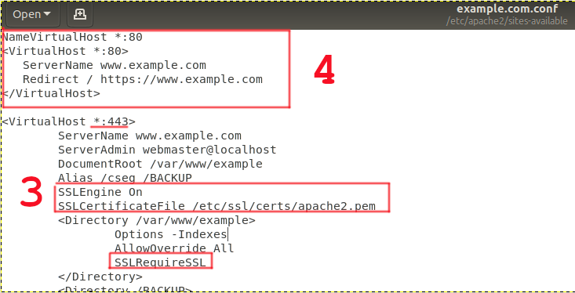

Seguridad. HTTPS
==============================

El protocolo https es idéntico al protocolo http con la excepción de que la transferencia de información entre el cliente (navegador web) y el servidor
(servidor web) viaja a través de Internet **cifrada** utilizando robustos algoritmos de cifrado de datos proporcionados por el paquete OpenSSL.
Durante la transmisión, se utilizan algoritmos de cifrado simétricos, pero para intercambiar las claves de cifrado, hay una sesión inicial de cifrado
asimétrico.

.. image:: img/https.png
                :width: 200 px
                :alt: Protocolo HTTPS
                :align: center

Los algoritmos de cifrado utilizados reúnen las características necesarias para garantizar que la información que sale desde el servidor hacia el cliente,
esté cifrada y solamente pueda ser descifrada por el cliente y que la información que sale desde el cliente hacia el servidor, esté cifrada y
solamente pueda ser descifrada por el servidor. Si durante la transferencia de la información un 'hacker' hiciera copia de los paquetes de datos e
intentara descifrarlos, los algoritmos garantizarían que no podría hacerlo por fuerza bruta (probando todas las claves posibles) en un plazo mínimo de
varios años.

**APACHE**

Al instalar apache2 se instala también el módulo ssl para apache2, por lo que no es necesario instalar ningún paquete adicional, tan solo debemos:

    1. Activar el módulo ssl.

        .. code-block:: shell-session

                # a2enmod ssl

    2. Generar un certificado para el servidor (Genera un certificado autofirmado) →  Durante la ejecución de comando contestaremos algunas preguntas como el nombre del servidor, el país, etc...

      .. code-block:: shell-session

                  # make-ssl-cert /usr/share/ssl-cert/ssleay.cnf /etc/ssl/certs/apache2.pem

    3. Crear servidor virtual seguro.
    4. Habilitar puerto(Listen 443)
    5. Redirigir HTTP a HTTPS
        * Opcional
        * mod_rewrite
        * Redirect
        * Ejemplos en la web

.. warning::

   La configuración del certificado público..https://www.linuxito.com/seguridad/598-como-crear-un-certificado-ssl-autofirmado-en-dos-simples-pasos para
   un escenario de prod..certificado por entidad....

.. raw:: html

            <iframe width="300" style="display:block; margin-left:auto; margin-right:auto;" src="https://www.youtube.com/embed/wq4S6BlIFmk" frameborder="0" allow="accelerometer; autoplay; clipboard-write; encrypted-media; gyroscope; picture-in-picture" allowfullscreen></iframe> 

.. raw:: html

         
        

        <u><b>PRÁCTICA 2</b></u> 
        Realiza la práctica 2 del Tema 5 del aula virtual. Configura tu servidor Apache de modo seguro.
        

         
