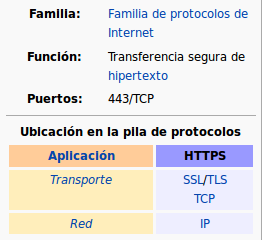

Seguridad. HTTPS
==============================

El protocolo https es idéntico al protocolo http con la excepción de que la transferencia de información entre el cliente (navegador web) y el servidor
(servidor web) viaja a través de Internet **cifrada** utilizando robustos algoritmos de cifrado de datos proporcionados por el paquete OpenSSL.
Durante la transmisión, se utilizan algoritmos de cifrado simétricos, pero para intercambiar las claves de cifrado, hay una sesión inicial de cifrado
asimétrico.

Los algoritmos de cifrado utilizados reúnen las características necesarias para garantizar que la información que sale desde el servidor hacia el cliente,
esté cifrada y solamente pueda ser descifrada por el cliente y que la información que sale desde el cliente hacia el servidor, esté cifrada y
solamente pueda ser descifrada por el servidor. Si durante la transferencia de la información un 'hacker' hiciera copia de los paquetes de datos e
intentara descifrarlos, los algoritmos garantizarían que no podría hacerlo por fuerza bruta (probando todas las claves posibles) en un plazo mínimo de
varios años.

**CONFIGURACIÓN**

La configuración de una web protegida con HTTPS, independientemente del servidor que utilicemos, se realiza básicamente con los siguientes pasos:

    1. Activar los módulos correspondientes (en el caso de Apache).
    2. Generar un certificado para el servidor. Recuerda conceptos *certificado, clave pública/privada* (https://www.manualesfaciles.com/certificados-diferencias-de-pem-crt-y-key/) →  Durante la ejecución de comando contestaremos algunas preguntas como el nombre del servidor, el país, etc...
          * ¿Ubicación de los certificados?
          * ¿Propietario/Permisos?
  
    3. Crear virtual host seguro.Incluyendo la *clave privada y el certificado* en la configuración
    4. Redirigir HTTP a HTTPS  →  (**OPCIONAL, aunque recomendable**)
    5. Activar el nuevo sitio creado →  (**a2ensite** si estamos en Apache, **ln -s** en NginX)

En los siguientes enlaces puedes encontrar unos sencillos tutoriales:

    - APACHE: https://techexpert.tips/es/apache-es/habilitar-https-en-apache/
    - NGINX: https://techexpert.tips/es/nginx-es/habilitar-https-en-nginx/

.. warning::

   Los ejemplos vistos se adaptan a un entorno de pruebas como el nuestro. Si estuvieras tratando con un entorno 'real' deberías obtener un certificado por parte de una
   `autoridad certificadora (CA) <https://es.wikipedia.org/wiki/Autoridad_de_certificaci%C3%B3n>`_. Tienes varias opciones:

      * CA de pago
      * Opciones gratuitas como `Let's Encrypt <https://letsencrypt.org/es/>`_, aunque en este caso necesitarias un dominio real público en la web (puedes usar una alternativa gratuita tipo `no-ip <https://www.noip.com/>`_ para hacer esto). 
      * Puedes encontrar un interesante manual en https://josejuansanchez.org/iaw/practica-https
