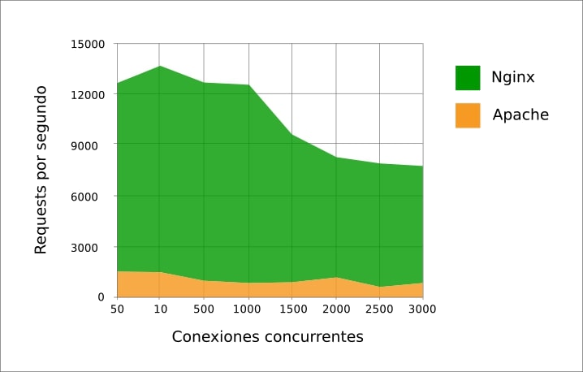

Rendimiento y optimización
==============================
El rendimiento de un servidor web, el más utilizado, y a través del cual se prestan muchos otros servicios(por ejemplo el WedDAV), es un aspecto crítico.
Para mejorar su rendimiento existen multitud de parámetros y módulos que pueden configurarse en función de nuestras necesidades.
Cada servidor suele tener en su documentación oficial, una guía de como **ajustar (tuning en inglés) el rendimiento (performance en inglés)**.

Apache
-------

Tal y como indica la documentación oficial... *"Apache es un servidor web de uso general, diseñado para proporcionar flexibilidad, portabilidad y
rendimiento. Aunque no ha sido diseñado específicamente para establecer récords de referencia, es capaz de ofrecer un alto rendimiento en muchas
situaciones. La versión 2.x contiene muchas optimizaciones adicionales para aumentar el rendimiento y la escalabilidad"*.
La mayoria de estas opciones de optimización y mejora del rendimiento de nuestro servidor Apache tienen que ver con tres conceptos:

    1. Opciones generales de optimización.
    2. Configuración Caché
    3. Módulos Apache.
    4. Controladores(**Handlers**)

**OPCIONES GENERALES**

    * Cuestiones relacionadas con configuraciones de Hardware, del sistema operativo sobre el que se ejecuta Apache o de la red. Puedes encontrar un manual bastante útil en la `documentación oficial <http://httpd.apache.org/docs/current/misc/perf-tuning.html>`_.

**CONFIGURACIÓN CACHÉ**

    * Podemos configurar nuestro Apache para que guarde en memoria algunos elementos de los que ofrece el servicio (`manual en la doc. oficial <https://httpd.apache.org/docs/2.4/caching.html>`_).
    * También existe la opción de ayudarnos con otros programas que actuen como intermediarios entre las peticiones de los clientes y el propio servidor web (ejemplos de esto pueden ser `Memcached <https://memcached.org/>`_ o `Varnish <https://varnish-cache.org/>`_).

**MÓDULOS DE APACHE**

    * La mayoría de opciones de optimización se configuran en `módulos <http://httpd.apache.org/docs/2.4/mod/>`_ independientes de Apache, los cuales deben activarse y configurarse adecuadamente (**mods_available/mods_enable**)

        .. code-block:: shell-session

                        # apachectl -V

        .. image:: img/mpmApache.png
                        :width: 300 px
                        :alt: MPM Apache
                        :align: center

    * En concreto, los **MPM-Módulos de multiprocesamiento** (`documentación oficial <http://httpd.apache.org/docs/current/mpm.html>`_) nos permiten configurar el modo en que apache gestiona las peticiones de cada cliente(navegador) conectado, desde el punto de vista en que son creados y manejados los procesos y subprocesos(hilos o threads en inglés) necesarios.

          .. Important::

              .. raw:: html

                  

                  Existen <b>3 modos de multiprocesamiento</b> en Apache <a class="footnote-ref" href="#fn:note1" role="doc-noteref">1</a>.
                  <ul>
                    <li>Prefork</li>
                    <li>Worker</li>
                    <li>Event</li>
                  </ul>
                  

**HANDLERS**

    * Los Handlers o Controladores son los programas encargados de ejecutar determinados ficheros del servicio web. La elección de unos u otros puede mejorar el rendimiento del servidor.
      El ejemplo más habitual en los actualmente es el del handler configurado en nuestro servidor para procesar las peticiones de paginas **.php**.
      Las alternativas existentes, tal y como puedes `consultar en la web <https://blog.ahierro.es/php-mod_php-vs-cgi-vs-fastcgi-vs-fpm/#modphp,_CGI,_FastCGI_o_FPM,_cual_es_mejor>`_, son:
          1. ***mod_php**
          2. CGI/_FastCGI
          3. **FPM**

.. warning::

   ¿Sabrías decir que tipo de configuración de MPM y handler de PHP necesitarías si fueras a alojar una web en tu servidor con una carga de actividad y número de peticiones elevadas y concurrentes?

NginX
-------

.. raw:: html

    

    Inicialmente desarrollado para superar el rendimiento de Apache sirviendo contenidos estáticos (imágenes, css..), Nginx usa menos memoria que
    Apache, y puede manejar aproximadamente cuatro veces más solicitudes. Por el contrario es menos flexible que Apache (no es tan módular como este).
    La realidad es que la mayoría de las webs con mayor actividad suelen estar alojadas en servidores NginX. De hecho, tal y como indica
    su web oficial <i>”NGINX es bien conocido como un balanceador de carga de alto rendimiento, caché y servidor web, que alimenta más del 40% de los
    sitios web más activos del mundo”</i>.
    Existen muchas opciones que podemos modificar para ajustar el rendimiento de nuestro servidor y que podemos encontrar en la web <a class="footnote-ref" href="#fn:note2" role="doc-noteref">2</a>.
    

IIS
-------

.. raw:: html

    

    Aunque Internet Information Services es claramente el que menos rendimiento ofrece entre los 3 servidores que hemos visto, ofrece algunas alternativas
    para mejorar su comportamiento. En la web<a class="footnote-ref" href="#fn:note3" role="doc-noteref">3</a> nos recomiendan desde el hardware más adecuado hasta la configuración de algunos parámetros
    en nuestros servidores con IIS.
    

Obtención de datos
------------------

Existen multitud de herramientas para hacer test de referencia (**benchmarking** en inglés) sobre servidores web, simulando multitud de conexiones y devolviendo los datos de tiempo y carga registrados en el servidor (Apache, NginX..)

.. important::

   Algunos ejemplos este tipo de SW que podemos usar para obtener cálculos del rendimiento de nuestros servidrores web son:

      * `AB (Apache Benchmarking) <https://httpd.apache.org/docs/2.4/programs/ab.html>`_, incluido en la instalación de Apache.
          .. code-block:: shell-session

                    $ ab -n 1000 -c 5 -k http://example.com

        .. image:: img/resultadoComandoAB.png
                        :width: 300 px
                        :alt: Resultado comando AB
                        :align: center

      * `Apache JMeter <https://jmeter.apache.org/>`_
      * `Gatling <https://gatling.io/>`_

.. raw:: html

         
        

        <u><b>EJERCICIO 3</b></u> 
        Realiza el ejercicio 3 del Tema 5 del aula virtual. Realiza comprobaciones del rendimiento de tu servidor web y configúralo para mejorar los resultados.
        

         

.. raw:: html

    
   

       

       <ol>
           <li class="footnote" id="fn:note1">
               

                   <b>Fuente:</b> <a href="https://www.digitalocean.com/community/tutorials/how-to-configure-apache-http-with-mpm-event-and-php-fpm-on-ubuntu-18-04-es" target="_blank">Cómo configurar el servidor HTTP Apache con MPM </a>
                   <a class="footnote-backref" rev="footnote" href="#fnref:note1">&#8617;</a>
               

           </li>
           <li class="footnote" id="fn:note2">
               

                   <b> Blog en la web oficial de NginX:</b> <a href="https://www.nginx.com/blog/performance-tuning-tips-tricks/" target="_blank">Performance Tuning – Tips & Tricks</a>
                  <a class="footnote-backref" rev="footnote" href="#fnref:note2">&#8617;</a>
               

           </li>
           <li class="footnote" id="fn:note3">
               

                   <b>Fuente:</b> <a href="https://docs.microsoft.com/en-us/windows-server/administration/performance-tuning/role/web-server/tuning-iis-10" target="_blank">Tunning IIS 10.0</a>
                   <a class="footnote-backref" rev="footnote" href="#fnref:note3">&#8617;</a>
               

           </li>
       </ol>
   

