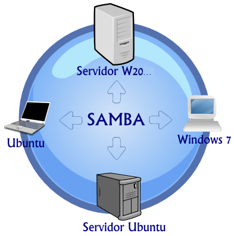

Acceso a ficheros
===============================

Desde las opciones más clásicas, como **FTP, NFS o Samba**, a herramientas
más actualizadas, apoyadas sobretodo por la tecnología HTTP/HTTPS, que nos permitirán crear servicios de alojamiento de archivos.
En el último apartado, conoceremos algún ejemplo de Sistema Operativo concebido para la gestión de almacenamiento en red (**NAS**).

Debemos tener en cuenta las características de las opciones para compartir ficheros más clásicas en comparación con las opciones de edición en linea y concurrencia que tenemos hoy en día,
las cuales eran impensables hace no tanto tiempo, y que son una de las bases del `Cloud Computing <https://w3techs.com/technologies/comparison/ws-apache,ws-microsoftiis,ws-nginx>`_.

WebDAV(HTTP/S)
--------------
A través de los protocolos HTTP/HTTPS podemos configurar el acceso remoto a sistemas de ficheros en nuestro/s servidor/es, con protocolos más modernos que FTP.
`WebDAV(Web Distributed Authoring and Versioning) <https://es.wikipedia.org/wiki/SSH_File_Transfer_Protocol>`_.

.. image:: img/introwebdav.png
    :width: 300 px
    :alt: WebDAV
    :align: center

Tal y como dice la `documentación oficial de Apache <https://httpd.apache.org/docs/2.4/mod/mod_dav.html>`_, el objetivo de este protocolo (o más concretamente EXTENSIÓN DE PROTOCOLO) es conseguir que la web (http/https) permita el acceso con permisos de escritura a recursos publicados.
Con él podemos hacer accesibles partes de nuestro sitio web como  un directorio remoto.

.. Warning::
   La directiva `DirectoryIndex <https://httpd.apache.org/docs/2.4/mod/mod_dir.html#directoryindex>`_ en Apache o `Autoindex <http://nginx.org/en/docs/http/ngx_http_autoindex_module.html>`_ en NginX para listar el contenido de un directorio del servidor suele ser una fuente de errores en combinación con WebDAV.
   **La recomendación general es desactivar esa directiva para poder utilizar los módulos dav**

Configuración en Apache
~~~~~~~~~~~~~~~~~~~~~~~

Los pasos a realizar, `extraídos del siguiente manual <https://cloudinfrastructureservices.co.uk/how-to-setup-apache-webdav-server-access-on-ubuntu-20-04/>`_, son:

    1. Activar los módulos correspondientes.

    .. code-block:: shell-session

                    # a2enmod dav dav_fs

    1. Añadir en nuestra configuración de Apache el módulo (sobre  un directorio/location) →  DAV On

        .. image:: img/webdav_1.png
            :width: 400 px
            :alt: WebDAV
            :align: center

    2. Añadir algún método de autenticación
        * ¿basic/digest?
        * ¿IP?
        * Sin autenticación Acceso libre

    3. Atención a permisos/propietario

        .. image:: img/webdav_2.png
            :width: 400 px
            :alt: WebDAV
            :align: center

    4. Limit/LimitExcept para que solo pida usuario/passwd en el caso de acceder a ficheros via dav (https://httpd.apache.org/docs/2.4/mod/mod_dav.html#page-header).
    5. Reiniciar apache

.. Important::
   En caso de querer dar acceso DAV **desde el directorio raiz de nuestro sitio web** debemos realizar algunas tareas más de configuración, sobretodo por la colisión con la 
   desactivación de la directiva *DirectoryIndex*
   
        .. image:: img/EjemploDAV_Raiz.png
                :width: 300 px
                :alt: Sw control de versiones
                :align: center

Configuración en NginX
~~~~~~~~~~~~~~~~~~~~~~~

Los pasos a realizar en este caso puedes encontrarlos en la `documentación oficial <http://nginx.org/en/docs/http/ngx_http_dav_module.html>`_, son:

    1. Instalar los paquetes correspondientes.

    .. code-block:: shell-session

                    # apt -y install nginx-extras libnginx-mod-http-dav-ext

    2. Añadir en nuestra configuración las opciones correspondientes. Un ejemplo podría ser el que mostramos a continuaciónn  (WEBDAVS ya que usamos HTTPS), y en el que aprovechando
    la directiva location dos para la misma ubicación podemos distinguir el comportamiento que  queremos si accedemos a través de navegador(HTTPS) o a través de un cliente DAV:

        .. image:: img/webdav_4_1.png
            :width: 400 px
            :alt: WebDAV
            :align: center

    3. El resto de aspectos a tener en cuenta son muy similares a Apache.

Clientes de WebDAV(S)
~~~~~~~~~~~~~~~~~~~~~~~

Puedes encontrar para cualquiera de nuestros SO habituales.
    * Windows: Con el programa WinSCP

    .. image:: img/WinSCP.png
            :width: 400 px
            :alt: WebDAV
            :align: center
  
    * Linux: Integrados en el gestor de ficheros. Tambien tenemos la opción de montajes con la herramientas **dav2fs** (https://wiki.archlinux.org/title/Davfs2)

    .. image:: img/ClienteDavLinux.png
            :width: 400 px
            :alt: WebDAV
            :align: center

.. raw:: html

         
        

        <u><b>PRÁCTICA 1</b></u> 
        Realiza la práctica de configuración de WebDAV
        

         

FTP
----
FTP (**File Transfer Protocol**, 'Protocolo de Transferencia de Archivos'), es un protocolo para la transferencia de archivos entre sistemas conectados a una red. Desde un
equipo cliente se puede conectar a un servidor para descargar archivos desde él o para enviarle archivos, independientemente del sistema operativo utilizado en
cada equipo. FTP está pensado para ofrecer la máxima velocidad en la conexión, pero no seguridad, ya que todo el intercambio de información, se realiza en texto
plano.

.. image:: img/protocoloftp.png
    :width: 200 px
    :alt: Protocolo FTP
    :align: center

Para solucionar este problema son de gran utilidad aplicaciones como scp y sftp, incluidas en el paquete SSH, o dotar de seguridad al propio servidor ftp con una
capa SSL similar a la utilizada en HTTPS, alternativas que permiten transferir archivos pero cifrando todo el tráfico.

    * `SFTP <https://es.wikipedia.org/wiki/SSH_File_Transfer_Protocol>`_.
    * `FTPS <https://es.wikipedia.org/wiki/FTPS>`_.

.. Warning::
   El servicio FTP puede trabajar de dos maneras (puedes encontrar una `información más detallada en la Wikipedia <https://es.wikipedia.org/wiki/Protocolo_de_transferencia_de_archivos#Modos_de_conexi%C3%B3n_del_cliente_FTP>`_):

      * ACTIVO
      * PASIVO

   Es importante conocer las características de cada una, ya que podemos encontrarnos problemas de funcionamiento dependiendo de las características de seguridad de
   la red bajo la que estemos trabajando.
   También hay que tener en cuenta que FTP es uno de los protocolos más antiguos (más incluso que HTTP) y presenta algunos problemas de seguridad y funcionamiento que hacen que sea una tecnología mucho menos utilizada que hace unos años.

Clientes
~~~~~~~~
Un cliente FTP emplea el protocolo FTP para conectarse a un servidor FTP para transferir archivos, independientemente del SO del propio cliente o del servidor.
Podemos encontrar clientes de varios tipos:

    1. LINEA DE COMANDOS: Algunos clientes de FTP/SFPT básicos vienen integrados en los sistemas operativos(Windows,Linux). Ofrecen un acceso rápido y sin necesidad de
    instalación de ningún paquete. Las instrucciones de estos comandos son universales, independientes del SO.

            .. image:: img/ejemploftpcomando.png
                :width: 300 px
                :alt: Ejemplo conexión comando FTP
                :align: center

        .. Tip::
           Puedes encontrar servidores públicos de FTP donde probar los comandos, incluso de subida de ficheros (en https://dlptest.com/ftp-test/ puedes encontrar un servidor que admite
           acceso 'público').

    1. INTEGRADOS EN EL NAVEGADOR: Muchos navegadores llevan integrados clientes FTP o permiten la instalación de *plugins*. En las versiones actuales o bien el soporte para FTP ha sido desactivado(https://www.trishtech.com/2021/04/how-to-re-enable-ftp-protocol-support-in-firefox/) o directamente ya no lo incluyen.

            .. image:: img/ejemploftpnavegador.png
                :width: 300 px
                :alt: Ejemplo conexión comando FTP
                :align: center

    2. PROGRAMAS ESPECÍFICOS: Hay disponibles clientes con **más funcionalidades y opciones**, tanto para Windows como para Unix/Linux o Mac. Algunos ejemplos podrían ser:

        * `FileZilla Client <https://filezilla-project.org/download.php?type=client>`_.
        * `WinSCP <https://winscp.net/eng/index.php>`_.
        * `Transmit <https://panic.com/transmit/>`_.

Servidores
~~~~~~~~~~
En este servicio debemos prestar atención a los siguientes elementos o propiedades:
  * Instalación y configuración del servicio sobre el SO correspondiente.
  * Crear los directorios donde se ubicarán los sitios FTP, con los PERMISOS ADECUADOS.
  * Creación de grupos y de directorios públicos asociados.
  * Parámetros de conexión
      * Nº máximo de conexiones.
      * Limitar anchos de banda.
      * Limitar acceso por IP/ Hora..
  * Tipos de usuari@/autenticación.
      * Usuari@s locales
      * Usuari@s virtuales. Varias posibilidades.
          * Bases de datos (MySql..)
          * Servicios de directorio (LDAP)
      * Autorizar acceso anónimo???
  * Enjaular a l@s usuari@s (**CHROOT**).
  * Soporte para conexiones seguras mediante SSL(instalación de certificados).

**SERVIDOR FTP EN LINUX**

Utilizaremos VsFTP (`manual en la web <https://help.ubuntu.com/community/vsftpd>`_ o también
la `documentación oficial <https://security.appspot.com/vsftpd/vsftpd_conf.html>`_  ), teniendo en cuenta lo siguiente:

  * # apt-get install vsftpd
  * La configuración bastante sencilla
  * Permite **servidores virtuales** (por IP)
  * Puede incluirse **cifrado** (FTP seguro)
  * **Enjaular usuarios** (*atención writeable chroot*)
  * El script de arranque y parada no ofrece mucha información (el comando *#/usr/sbin/vsftpd /etc/vsftpd.conf* ofrece algo más de información de lo que está pasando)
  * Usuari@s virtuales, por ejemplo generados con el comando **htpasswd**.
          * https://wiki.archlinux.org/title/Very_Secure_FTP_Daemon#Tips_and_tricks
             - *#htpasswd -d* (usando crypt)
             - Generando un fichero /etc/pam.d/vsftpd y un vsftpd.conf similares a los incluidos en el espacio virtual del módulo.  

.. note:: 
   Sería un ejercicio interesante realizar la instalación y configuración de un servidor FTP en una MV Linux, con las siguientes características:
        * No permite las conexiones anónimas.
        * Funciona en modo pasivo. Determina los puertos donde se puede conectar.
        * Crea las reglas correspondientes de firewall para que permita su acceso.
        * Personaliza el mensaje de bienvenida
        * Exisitiran una seria de usuarios creado con la utilidad htpasswd (usuarios virtuales) que accederan al servidor. Debes crear también sus carpetas con los permisos correspondientes.
        * El servidor prohibe la conexión de algunos usuarios. Los que aparezcan en un determinado fichero (El que tu quieras).
        * Los usuarios son enjaulados. Atentos a los mensajes que proporciona al servidor.
        * El servidor funciona en modo seguro de manera forzosa.
        * Los nombre de ficheros/carpetas deben verse correctamente(acentos, eñes...)
  

.. raw:: html

         
        

        <u><b>PRÁCTICA 2</b></u> 
        Servidor FTP seguro en una Instancia en la nube con usuarios virtuales y utización de sistemas de ficheros remoto(NFS/EFS).
        

         

Control de versiones
--------------------
Un `control de versiones <https://es.wikipedia.org/wiki/Control_de_versiones>`_ es un sistema que registra los cambios realizados en archivos a lo largo del tiempo, de modo que puedas recuperar versiones específicas más adelante.
Aunque su origen era el código fuente compartido, maneja cualquier tipo de archivo. A estos sistemas de almacenamiento se les suele denominar **repositorios**. Dos de los ejemplos más populares(**trabajando
ambos bajo los protocolos HTTP/HTTPS**) para el control de versiones son:

    1. Subversion(https://subversion.apache.org/)
    2. **GIT** (https://git-scm.com/)

.. image:: img/introrepositiorios.png
                :width: 300 px
                :alt: Sw control de versiones
                :align: center

.. Warning::
   ¿Conoces algún repositorio público en la web?¿Qué sistema de control de versiones emplean?¿Para que crees que se utilizan estos repositorios?

Hay multitud de opciones gratuitas para tener un repositorio en la web. Pero...¿Si queremos nuestro repositorio propio?. Montar nuestro propio
sistema de control de versiones no es demasiado complejo. Puedes encontrar ayuda en el video a continuación o en el `siguiente tutorial <https://www.ecodeup.com/instala-y-crea-tu-primer-repositorio-local-con-git-en-windows/>`_.

.. raw:: html

      <iframe width="300" style="display:block; margin-left:auto; margin-right:auto;" src="https://www.youtube.com/embed/XNRYPs8SGhg" frameborder="0" allow="accelerometer; autoplay; clipboard-write; encrypted-media; gyroscope; picture-in-picture" allowfullscreen></iframe> 

La manera de trabajar y comunicarse con el repositorio depende del programa bajo el que lo hayamos instalado. En el ejemplo de GIT el **flujo de trabajo(workflow)** sería
algo parecido a la siguiente imagen.

.. image:: img/GitDiagram.svg
               :width: 400 px
               :alt: Sw control de versiones
               :align: center

.. Warning::
   En los repositorios se utilizan términos como **TRUNK, TAG o BRANCH**. Debemos conocer su significado para entender correctamente como trabajan los sistemas de
   control de versiones.

     .. image:: img/branchtagtrunk.png
                    :width: 300 px
                    :alt: Sw control de versiones
                    :align: center

Para comunicarse con los repositorios tienes varias opciones, además de la linea de comandos, gran cantidad de `Clientes GUI <https://git-scm.com/downloads/guis/>`_ que nos van a facilitar el trabajo entre nuestro **Working Directory y el repositorio**.

Conociendo su funcionamiento, ya podemos configurar nuestro equipo para tener un **WD(working directory)** vinculado con cualquier repositorio publico disponible en la web.

.. raw:: html

      <iframe width="300" style="display:block; margin-left:auto; margin-right:auto;" src="https://www.youtube.com/embed/3XlZWpLwvvo" frameborder="0" allow="accelerometer; autoplay; clipboard-write; encrypted-media; gyroscope; picture-in-picture" allowfullscreen></iframe> 

.. Important::
   Un buen ejercicio podría consistir en crear una cuenta en algún sitio público  que ese GIT (github, gitlab, gitbook....), crees tu primer repositorio y
   lo conectes a un cliente GIT para trabajar con él. Piensa en las utilidades que podría tener este repositorio:

        * Alojar el código fuente de tus proyectos de IAW.
        * Copias de seguridad y configuraciones de tus BD.
        * C. Seg de tus ficheros de conf. de SER.
        * Tu documentación, anotaciones de distintas categorías.

Sistemas de ficheros en red
----------------------------

Si hablamos de redes locales (LAN) y compartir ficheros y recursos, tenemos varios sistemas de ficheros destacados:
    * Network File System (**NFS**): Sistemas UNIX-Linux. 
    * Server Message Block (**SMB/CIFS**):​ Protocolo para compartir archivos, impresoras... entre sistemas Windows. Aunque es un protocolo propiedad de Microsoft, tiene
      algunas implementaciones libres, por ejemplo SAMBA en versiones Linux.
    * Linux incluye algunos comandos muy útiles de gestión remota de ficheros (**rsync, scp...**).
    * Sistemas de ficheros compartidos en la nube. Ejemplos:
        * AWS -> EFS(Elastic FileSystem) puede ser un ejercicio muy práctico y real el enlazar tu sitio web a uno de estos sistemas, tal y como explica en https://docs.aws.amazon.com/es_es/efs/latest/ug/wt2-apache-web-server.html.
        * Azure -> Azure Files (https://azure.microsoft.com/es-es/products/storage/files/).
        * Google Cloud -> FileStore (https://cloud.google.com/filestore?hl=es).

SAMBA es una opción bastante sencilla para poder compartir recursos entre máquinas Windows y Linux. No importa que SO sea el servidor y que SO actúe de cliente.

.. raw:: html

      <iframe width="300" style="display:block; margin-left:auto; margin-right:auto;" src="https://www.youtube.com/embed/NXsl7WTdKjs?si=BEoKgMl_re0zGq_u" frameborder="0" allow="accelerometer; autoplay; clipboard-write; encrypted-media; gyroscope; picture-in-picture" allowfullscreen></iframe> 

.. note:: 
   ¿Sabrías realizar la siguientes configuraciones en un sistema en la nube?

   1. Montar tu servidor web en la nube en una sistema de ficheros EFS, conectándolo automáticamente a tu instancia EC2.
   2. ¿Sabrías además conectarte a ese sistema de ficheros desde tu equipo local? 
       * A través de las herramientas oficiales de AWS (https://docs.aws.amazon.com/efs/latest/ug/efs-onpremises.html.)
       * Sin tener que acudir a servicios más costosos(como AWS VPN), podemos aprovechar el `tunneling-ssh <https://www.sombreroblanco.es/2018/10/tunel-ssh-for-dummies-una-explicacion-sencilla/>`_, tal y como indica en el apartado correspondiente en el tutorial ubicado en https://dodov.dev/blog/how-to-mount-amazon-efs-on-windows

Sistemas Operativos NAS
-----------------------

En este apartado nos referimos a distribuciones Linux diseñadas para almacenamiento conectado a la red **NAS, siglas de Almacenamiento Conectado en
Red (Network Attached Storage)**. Muchos de estos SSOO tienen un carácter gratuito, open-source y software libre (basado en licencia BSD) y nos
permiten administrar soportes de almacenamiento accesible desde red, por ejemplo para almacenamientos masivos de información, música, backups, etc.
Dos ejemplos:

    * FreeNAS: https://www.freenas.org/
        .. image:: img/Freenas.png
            :width: 400 px
            :alt: Ejemplo freenas
            :align: center
    * OpenMediaVault (necesita menos recursos para funcionar): https://www.openmediavault.org/
        .. image:: img/OpenMediaVault.png
            :width: 400 px
            :alt: Ejemplo openmediavault
            :align: center

Para poder practicar con estas distribuciones podemos hacer uso de la virtualización. Vamos a simular nuestro NAS, como si hubiéramos comprado uno. Para ello
debemos dar los siguientes pasos:

    1 Crearemos una MV
       * OpenMediaVault/FreeNAS ISO
       * Atentos-as a los requisitos y al tipo de la MV

    2 Añadimos disco/s duro/s a nuestra configuración (nuestro NAS)
       * Podemos añadir los que queramos y darle estructura de RAID/LVM¿?¿

    3 Configuramos la red de la MV para hacerlo pública

    4 Primeras tareas
       * Crear pool
       * Usuarios/grupos
       * Configuramos el/los servicios que queramos proporcionar
          * SMB
          * WebDAV
          * FTP
          * Git

.. Important::
   Configurar tu propio NAS instalando uno de los SO comentados en una MV, añade tantos DD virtuales como quieras y 'juega' con las opciones de servicios, uso y seguridad que te ofrecen.
