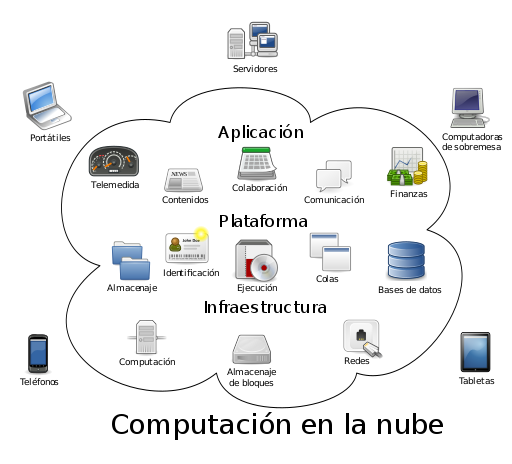

========================
Acceso
========================

En este tema vamos a conocer algunas opciones para acceder en remoto a nuestros sistemas (ficheros y sesiones de terminal con o sin GUI).  Inicialmente estos servicios
suelen estar pensados para ofrecerse dentro de nuestra LAN.

.. Warning::
   ¿Pueden/Deben usarse estos servicios más allá de una LAN?¿Sabrías decir que habría que configurar para poder hacerlo?

Los distintos apartados(la verdad es que es un tema que podríamos incluir otros muchos aspectos) que vamos a estudiar en este tema son:

.. toctree::
   :maxdepth: 2

   Accesofichero
   Accesoremoto
   
   
