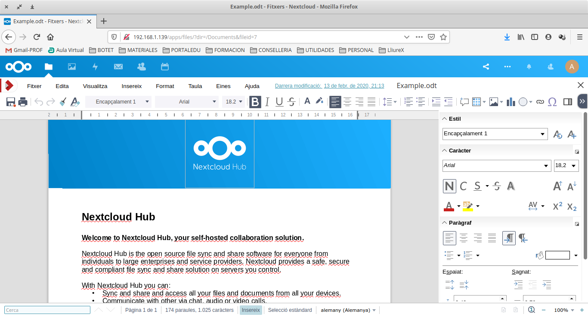

Cloud Computing
===============

Tod@s conocemos, y probablemente utilicemos, la computación en la nube. El acceso a los recursos desde cualquier parte, y con las posibilidades de edición y
sincronización de nuestros datos ha hecho que sea el sistema de trabajo de cualquier empresa, independientemente de su ámbito de actuación.

De nuevo, como en el punto anterior..¿Si queremos nuestro servidor propio..?:

Vamos a montar nuestra nube local, con el apoyo de docker, y con las herramientas NEXTCLOUD y COLLABORA (también puedes probar con ONLYOFFICE). Puedes utilizar lo indicado en el
`siguiente manual <https://www.collaboraoffice.com/code/quick-tryout-nextcloud-docker/>`_

.. Important::
   En la actualidad muchos de los servidores y servicios se encuentran ubicados en servicios remotos (cloud), como pueden ser:
          * Amazon Web Services
          * Microsoft Azure
          * Google Cloud
          
   En ellos podemos crear instancias de MV/Cotenedores, publicar servicios, gestionar almacenamiento remoto, BBDD, crear infraestructuras de red....
   También existen alternativas para crear nuestro propio cloud, como OpenShift
