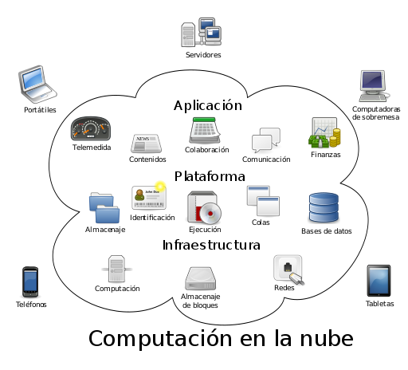

========================
Acceso Remoto a Ficheros
========================

En este tema vamos a conocer algunas opciones para compartir recursos (generalmente ficheros). Desde las opciones más clásicas, como **FTP, NFS o Samba**, a herramientas
más actualizadas, apoyadas sobretodo por la tecnología HTTP/HTTPS, que nos permitirán crear servicios de alojamiento de archivos.
En el último apartado, conoceremos algún ejemplo de Sistema Operativo concebido para la gestión de almacenamiento en red (**NAS**).

Debemos tener en cuenta las características de las opciones para compartir ficheros más clásicas en comparación con las opciones de edición en linea y concurrencia que tenemos hoy en día,
las cuales eran impensables hace no tanto tiempo, y que son una de las bases del `Cloud Computing <https://w3techs.com/technologies/comparison/ws-apache,ws-microsoftiis,ws-nginx>`_.

Los distintos apartados(la verdad es que es un tema que podríamos incluir otros muchos aspectos) que vamos a estudiar en este tema son:

.. toctree::
   :maxdepth: 2

   servicioslan
   ftp
   webdav
   versiones
   cloud
   ssoonas
