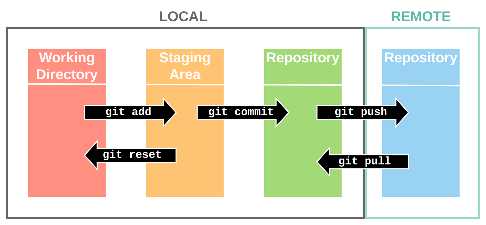

Control de versiones
====================
Un `control de versiones <https://es.wikipedia.org/wiki/Control_de_versiones>`_ es un sistema que registra los cambios realizados en archivos a lo largo del tiempo, de modo que puedas recuperar versiones específicas más adelante.
Aunque su origen era el código fuente compartido, maneja cualquier tipo de archivo. A estos sistemas de almacenamiento se les suele denominar **repositorios**. Dos de los ejemplos más populares(**trabajando
ambos bajo los protocolos HTTP/HTTPS**) para el control de versiones son:

    1. Subversion(https://subversion.apache.org/)
    2. **GIT** (https://git-scm.com/)

.. image:: img/introrepositiorios.png
                :width: 300 px
                :alt: Sw control de versiones
                :align: center

.. Warning::
   ¿Conoces algún repositorio público en la web?¿Qué sistema de control de versiones emplean?¿Para que crees que se utilizan estos repositorios?

Hay multitud de opciones gratuitas para tener un repositorio en la web. Pero...¿Si queremos nuestro repositorio propio?. Montar nuestro propio
sistema de control de versiones no es demasiado complejo. Puedes encontrar ayuda en el video a continuación o en el `siguiente tutorial <https://www.ecodeup.com/instala-y-crea-tu-primer-repositorio-local-con-git-en-windows/>`_.

.. raw:: html

      <iframe width="300" style="display:block; margin-left:auto; margin-right:auto;" src="https://www.youtube.com/embed/XNRYPs8SGhg" frameborder="0" allow="accelerometer; autoplay; clipboard-write; encrypted-media; gyroscope; picture-in-picture" allowfullscreen></iframe> 

La manera de trabajar y comunicarse con el repositorio depende del programa bajo el que lo hayamos instalado. En el ejemplo de GIT el **flujo de trabajo(workflow)** sería
algo parecido a la siguiente imagen.

.. Important::
   En los repositorios se utilizan términos como **TRUNK, TAG o BRANCH**. Debemos conocer su significado para entender correctamente como trabajan los sistemas de
   control de versiones.

     .. image:: img/branchtagtrunk.png
                    :width: 300 px
                    :alt: Sw control de versiones
                    :align: center

Para comunicarse con los repositorios tienes varias opciones, además de la linea de comandos, gran cantidad de `Clientes GUI <https://git-scm.com/downloads/guis/>`_ que nos van a facilitar el trabajo entre nuestro **Working Directory y el repositorio**.

Conociendo su funcionamiento, ya podemos configurar nuestro equipo para tener un **WD(working directory)** vinculado con cualquier repositorio publico disponible en la web.

.. raw:: html

      <iframe width="300" style="display:block; margin-left:auto; margin-right:auto;" src="https://www.youtube.com/embed/3XlZWpLwvvo" frameborder="0" allow="accelerometer; autoplay; clipboard-write; encrypted-media; gyroscope; picture-in-picture" allowfullscreen></iframe> 

.. raw:: html

         
        

        <u><b>Ejercicio 1</b></u> 
        Crea tu primer repositorio público en la web.
        

         
